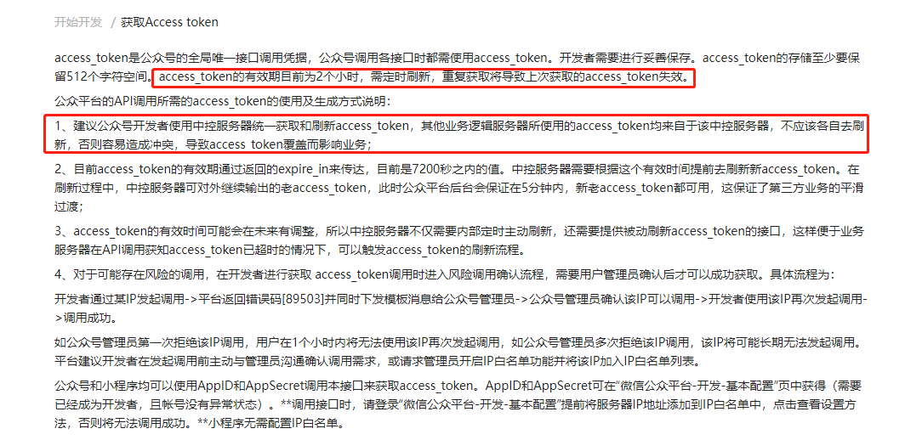
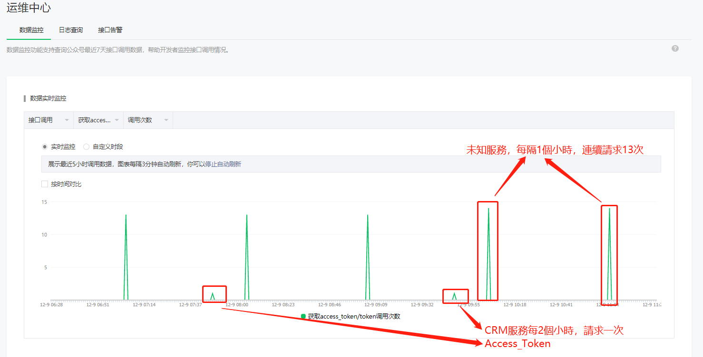

## 前端获取config接口所需入参
```java
@ApiModel("微信获取jsSDK相关信息需要的参数")
@Getter
@Setter
public class WeChatJsSDKInfoRequestBo {

  @ApiModelProperty(name = "url", value = "url", required = true)
  @NotBlank(message = "url不能為空")
  private String url;

}
```
```java
@RestController
@Api(tags = ("微信配置信息控制器"))
public class WeChatConfController {
  @Autowired
  private WeChatConfService weChatConfService;

  @GetMapping("/wechat/jsSDK")
  @ApiOperation(value = "获取微信js-sdk使用的相关信息")
  @IgnoreScyPermission
  public ResponseDTO<WeChatJsSDKInfoVo> getJsSDKInfo(WeChatJsSDKInfoRequestBo weChatJsSDKInfoRequestBo) {
    return ResponseDTO.ok(weChatConfService.getSDKInfo(weChatJsSDKInfoRequestBo));
  }
}
```
```java
@ApiModel("微信公众号获取Token")
@Getter
@Setter
public class WeChatTokenVo {

  @ApiModelProperty(name = "accessToken", value = "获取到的凭证")
  private String accessToken;

  @ApiModelProperty(name = "expiresIn", value = "凭证有效时间，单位：秒")
  private Integer expiresIn;

}
```
```java
@ApiModel("微信获取jsSDK相关信息")
@Getter
@Setter
public class WeChatJsSDKInfoVo {

  @ApiModelProperty(name = "appId", value = "公众号的唯一标识")
  private String appId;

  @ApiModelProperty(name = "timestamp", value = "生成签名的时间戳")
  private String timestamp;

  @ApiModelProperty(name = "nonceStr", value = "生成签名的随机串")
  private String nonceStr;

  @ApiModelProperty(name = "signature", value = "签名")
  private String signature;

}
```
```java
@Service
public class WeChatConfService {

  private static final String APP_ID = "XXX";
  private static final String API_GET_TICKET = "https://api.weixin.qq.com/cgi-bin/ticket/getticket?";

  @Autowired
  private WeChatAuthService weChatAuthService;

  public WeChatJsSDKInfoVo getSDKInfo(WeChatJsSDKInfoRequestBo weChatJsSDKInfoRequestBo) {
    // 获取access_token
    WeChatTokenVo weChatTokenVo = weChatAuthService.generateToken();
    // 请求微信接口获取jsapi_ticket
    Map<String, String> paramMap = new HashMap<>();
    paramMap.put("access_token", weChatTokenVo.getAccessToken());
    paramMap.put("type", "jsapi");
    Map<String, Object> responseBodyMap = weChatHttpService.get(paramMap, API_GET_TICKET);
    // 初始化相关参数
    WeChatJsSDKInfoVo weChatJsSDKInfoVo = new WeChatJsSDKInfoVo();
    // appId(公众号的唯一标识)
    weChatJsSDKInfoVo.setAppId(APP_ID);
    // 生成签名的时间戳
    weChatJsSDKInfoVo.setTimestamp(String.valueOf(System.currentTimeMillis() / 1000));
    // 生成签名的随机串
    weChatJsSDKInfoVo.setNonceStr(RandomUtil.obtainRandomStr(16, RandomUtil.TOTAL_ARR));
    // 签名
    String signature = getSignature(String.valueOf(responseBodyMap.get("ticket")),
        weChatJsSDKInfoVo.getNonceStr(), weChatJsSDKInfoVo.getTimestamp(), weChatJsSDKInfoRequestBo.getUrl());
    weChatJsSDKInfoVo.setSignature(signature);
    return weChatJsSDKInfoVo;
  }

  private String getSignature(String ticket, String noncestr, String timestamp, String url) {
    StringJoiner joiner = new StringJoiner("&");
    joiner.add("jsapi_ticket=" + ticket).add("noncestr=" + noncestr).add("timestamp=" + timestamp).add("url=" + url);
    return DigestUtils.sha1Hex(joiner.toString());
  }

}
```
```java
@Slf4j
@Service
public class WeChatAuthService {

  private static final String KEY_CLIENT_CREDENTIAL_ACCESS_TOKEN = "weChat_client_credential:access_token";
  private static final String APP_ID = "XXX";
  private static final String APP_SECRET = "XXX";
  private static final String API_TOKEN = "https://api.weixin.qq.com/cgi-bin/token?";

  public WeChatTokenVo generateToken() {
    WeChatTokenVo result = new WeChatTokenVo();
    String accessToken = (String) redisCacheService.get(KEY_CLIENT_CREDENTIAL_ACCESS_TOKEN);
    if (StringUtil.isBlank(accessToken)) {
      // 組裝參數
      Map<String, String> paramMap = new HashMap<>();
      paramMap.put("appid", APP_ID);
      paramMap.put("secret", APP_SECRET);
      paramMap.put("grant_type", "client_credential");
      // 請求微信接口，GET請求
      Map<String, Object> responseBodyMap = weChatGetRequest(paramMap, API_TOKEN);
      result.setAccessToken(String.valueOf(responseBodyMap.get("access_token")));
      result.setExpiresIn(Integer.valueOf(String.valueOf((responseBodyMap.get("expires_in")))));
      // 设置缓存
      redisCacheService.set(KEY_CLIENT_CREDENTIAL_ACCESS_TOKEN, result.getAccessToken(), result.getExpiresIn(), TimeUnit.SECONDS);
    } else {
      result.setAccessToken(accessToken);
      result.setExpiresIn(redisCacheService.getExpire(KEY_CLIENT_CREDENTIAL_ACCESS_TOKEN, TimeUnit.SECONDS).intValue());
    }
    return result;
  }

}
```
```java
@Service
@Slf4j
public class WeChatHttpService {
  @Autowired
  private RestTemplate weChatRestTemplate;

  public Map<String, Object> get(Map<String, String> paramMap, String url) {
    // 格式化url
    url = formatUrl(paramMap, url);
    // 请求
    ResponseEntity<String> weChatResponse = weChatRestTemplate.getForEntity(url, String.class, paramMap);
    // 校验响应
    checkResponse(weChatResponse);
    // 结果
    String responseBody = weChatResponse.getBody();
    log.info("請求：" + url);
    log.info("參數：" + paramMap);
    log.info("返回值：" + responseBody);
    Map<String, Object> responseBodyMap = CollectionUtil.jsonStrToMap(responseBody);
    // 檢查返回值errCode是否为0
    WeChatErrorEnum.WECHAT_RESPONSE_FAIL_ERROR.isFalse(!Objects.equals(0, responseBodyMap.get("errcode")));
    return responseBodyMap;
  }

  private void checkResponse(ResponseEntity responseEntity) {
    // 檢查微信返回值是否為null
    WeChatErrorEnum.WECHAT_RESPONSE_NULL_ERROR.isNull(responseEntity);
    // 檢查微信返回狀態
    WeChatErrorEnum.WECHAT_RESPONSE_STATUS_ERROR.isFalse(HttpStatus.OK == responseEntity.getStatusCode());
    // 檢查微信返回值Body是否為null
    WeChatErrorEnum.WECHAT_RESPONSE_BODY_NULL_ERROR.isNull(responseEntity.getBody());
  }

  private String formatUrl(Map<String, String> paramMap, String url) {
    // 組裝url
    StringBuilder urlSb = new StringBuilder();
    urlSb.append(url);
    for (String paramKey : paramMap.keySet()) {
      urlSb.append(paramKey).append("={").append(paramKey).append("}&");
    }
    return urlSb.toString();
  }

}
```
```java
public class RandomUtil {

  private RandomUtil() { }

  private static Random rd = new Random();

  // 支持多长度，数字和字符，排除0和o及O（含大小写）排除i、I、l、L、1
  public static final Character[] CUSTOMIZED_ARR = {'a', 'b', 'c', 'd', 'e', 'f', 'g', 'h', 'j', 'k', 'm', 'n', 'p', 'q',
    'r', 's', 't', 'u', 'v', 'w', 'x', 'y', 'z', 'A', 'B', 'C', 'D', 'E', 'F', 'G', 'H', 'J', 'K', 'M', 'N',
    'P', 'Q', 'R', 'S', 'T', 'U', 'V', 'W', 'X', 'Y', 'Z', '2', '3', '4', '5', '6', '7', '8', '9'};

  // 支持多长度，数字和字符（含大小写）
  public static final Character[] TOTAL_ARR = {'a', 'b', 'c', 'd', 'e', 'f', 'g', 'h', 'i', 'j', 'k', 'l', 'm', 'n', 'o', 'p', 'q',
    'r', 's', 't', 'u', 'v', 'w', 'x', 'y', 'z', 'A', 'B', 'C', 'D', 'E', 'F', 'G', 'H', 'I', 'J', 'K', 'L', 'M', 'N', 'O',
    'P', 'Q', 'R', 'S', 'T', 'U', 'V', 'W', 'X', 'Y', 'Z', '1', '2', '3', '4', '5', '6', '7', '8', '9', '0'};

  // 支持字符
  public static final Character[] CHARACTER_ARR = {'a', 'b', 'c', 'd', 'e', 'f', 'g', 'h', 'i', 'j', 'k', 'l', 'm', 'n', 'o', 'p', 'q',
    'r', 's', 't', 'u', 'v', 'w', 'x', 'y', 'z', 'A', 'B', 'C', 'D', 'E', 'F', 'G', 'H', 'I', 'J', 'K', 'L', 'M', 'N', 'O',
    'P', 'Q', 'R', 'S', 'T', 'U', 'V', 'W', 'X', 'Y', 'Z'};

  // 支持大写字符
  public static final Character[] CHARACTER_UPPER_ARR = {'A', 'B', 'C', 'D', 'E', 'F', 'G', 'H', 'I', 'J', 'K', 'L', 'M', 'N', 'O',
    'P', 'Q', 'R', 'S', 'T', 'U', 'V', 'W', 'X', 'Y', 'Z'};

  // 支持小写字符
  public static final Character[] CHARACTER_LOWER_ARR = {'a', 'b', 'c', 'd', 'e', 'f', 'g', 'h', 'i', 'j', 'k', 'l', 'm', 'n', 'o',
    'p', 'q', 'r', 's', 't', 'u', 'v', 'w', 'x', 'y', 'z'};

  // 支持数字
  public static final Character[] NUMBER_ARR = { '0', '1', '2', '3', '4', '5', '6', '7', '8', '9' };
  
  //base_58 不使用数字 "0"，字母大写"O"，字母大写 "I"，和字母小写 "l"
  public static final Character[] BASE58_NUMBER_ARR = { '1', '2', '3', '4', '5', '6', '7', '8', '9' };
  public static final Character[] BASE58_CHARACTER_UPPER_ARR = {'A', 'B', 'C', 'D', 'E', 'F', 'G', 'H', 'J', 'K', 'L', 'M', 'N',
      'P', 'Q', 'R', 'S', 'T', 'U', 'V', 'W', 'X', 'Y', 'Z'};
  public static final Character[] BASE58_CHARACTER_LOWER_ARR = {'a', 'b', 'c', 'd', 'e', 'f', 'g', 'h', 'i', 'j', 'k', 'm', 'n', 'o',
      'p', 'q', 'r', 's', 't', 'u', 'v', 'w', 'x', 'y', 'z'};

  /**
   * <p>Title: createRandomString</p>
   * <p>Description: 获得密码(支持多长度，数字和字符，排除0和o及O（含大小写）)</p>
   * @param len 密码长度
   * @return
   */
  public static String obtainRandomStr(int len, Character[]... charRangeArrays) {
    if (charRangeArrays == null) {
      return null;
    }
    if (len < charRangeArrays.length) {
      return null;
    }
    
    List<Character> lists = new ArrayList<Character>(); 
    char[] chArr = new char[len];
    //确保每个数组中选定一个
    for(int i = 0; i < charRangeArrays.length; i++) {
      final int maxNum = charRangeArrays[i].length;
      chArr[i] = charRangeArrays[i][rd.nextInt(maxNum)];
      
      lists.addAll(Arrays.asList(charRangeArrays[i]));
    }
   
    for(int i = charRangeArrays.length; i < len; i++) {
      chArr[i] = lists.get(rd.nextInt(lists.size()));
    }
    
    for(int i = 0; i < len; i++){
      int r = i + rd.nextInt(len - i);
      char temp = chArr[i];
      chArr[i] = chArr[r];
      chArr[r] = temp;
    }
    
    return new String(chArr);
  }

  /**
   * <p>Title: 获取随机数字</p>  
   * <p>Description: </p>
   * @param maxNumber：最大可随机数字，最小随机数字为1
   * @return
   */
  public static int obtainRandomNumber(int maxNumber) {
    int random = Math.abs(rd.nextInt(maxNumber));// maxNum=100时， 100是不包含在内的，只产生0~99之间的数
    random = random + 1;
    return random;
  }

  /**
   * 生成固定长度的随机数
   * @param length 固定长度
   * @return 随机数字符串
   */
  public static String fixedLengthRandomNumber(int length) {
    StringBuilder sb = new StringBuilder();
    for (int i = 0; i < length; i++) {
      sb.append(rd.nextInt(10));
    }
    return sb.toString();
  }

  public static int nextInt() {
    return rd.nextInt();
  }

}
```

## 上传图片
```java
@ApiModel("微信公众号上传图片信息")
@Getter
@Setter
public class WeChatOaUploadBo {

  @ApiModelProperty(name = "mediaId", value = "serverId")
  @NotBlank(message = "serverId不能為空")
  private String mediaId;

}
```
```java
@RestController
@RequestMapping("/p/active/weChatOa")
@Api(tags = ("激活用戶"))
public class ActiveOfWeChatOaController {

  @Autowired
  private ActiveOthersService activeOthersService;

  @PostMapping("/upload")
  @ApiOperation(value = "根据serverId下载微信服务器上的媒体文件并上传至内部服务器")
  public ResponseDTO<String> upload(@ApiParam(value = "微信图片查询参数", required = true) @RequestBody @Valid WeChatOaUploadBo weChatOaUploadBo) {
    return ResponseDTO.ok(activeOthersService.upload(weChatOaUploadBo));
  }

}
```
```java
@Service
@Slf4j
public class ActiveOthersService {

  private static final String API_MEDIA_GET = "https://api.weixin.qq.com/cgi-bin/media/get?";

  @Autowired
  private WeChatAuthService weChatAuthService;

  public String upload(WeChatOaUploadBo weChatOaUploadBo) {
    // 获取access_token
    WeChatTokenVo weChatTokenVo = weChatAuthService.generateToken();
    // 组装参数
    Map<String, String> paramMap = new HashMap<>();
    paramMap.put("access_token", weChatTokenVo.getAccessToken());
    paramMap.put("media_id", weChatOaUploadBo.getMediaId());
    // 请求
    Map<String, Object> responseMap = weChatHttpService.getFile(paramMap, API_MEDIA_GET);
    // 解析结果
    Object fileName = responseMap.get("fileName");
    String fileType = FileUtil.getFileType(fileName == null ? "default.png" : fileName.toString());
    String fileFullName = FileUtil.generateFileFullName(storeProperties.getTempPath(), fileType);
    InputStream inputStream = new ByteArrayInputStream((byte[]) responseMap.get("body"));
    // 构建文件
    File file = FileUtil.inputStreamWriteToFile(inputStream, fileFullName);
    MultipartFile multipartFile = FileUtil.file2MultipartFile(file);
    // 上传图片
    ResponseDTO<String> responseDTO = staticUploadClient.uploadImage(multipartFile);
    // 删除临时文件
    FileUtil.remove(file);
    ActiveUserErrorEnum.FILE_UPLOAD_ERROR.isTrue(!ResponseUtil.isSuccess(responseDTO) || StringUtil.isBlank(responseDTO.getData()));
    log.info("上传图片路径：{}", responseDTO.getData());
    return responseDTO.getData();
  }

}
```

## token失效问题
  

基于上诉说明，对代码进行同步控制：  
```java
@Slf4j
@Service
public class WeChatAuthService {

  @Autowired
  private RedisLockService redisLockService;  

  public WeChatTokenVo generateToken() {
    // 加锁控制
    String lockKey = "weChatApiToken:" + appId + ":" + secret;
    redisLockService.obtainDistributedLock(lockKey, 30000, true);
    try {
      // ...
    } finally {
      redisLockService.releaseDistributedLock(lockKey);
    }
  }
}
```

最后发现还是出现失效问题，问了微信开发社区，了解到可以通过公众号的运维中心查看日志：  
  

原来是公司内部的其它部分也在使用获取token，导致token被覆盖而失效  

参考：  
[https://developers.weixin.qq.com/doc/offiaccount/OA_Web_Apps/JS-SDK.html](https://developers.weixin.qq.com/doc/offiaccount/OA_Web_Apps/JS-SDK.html)  
[https://blog.csdn.net/m0_37270964/article/details/105387178](https://blog.csdn.net/m0_37270964/article/details/105387178)  
[https://segmentfault.com/a/1190000019456229?utm_source=tag-newest](https://segmentfault.com/a/1190000019456229?utm_source=tag-newest)  
[https://www.cnblogs.com/lemonphp/p/6807784.html](https://www.cnblogs.com/lemonphp/p/6807784.html)  
[https://www.cnblogs.com/jiqing9006/p/5038340.html](https://www.cnblogs.com/jiqing9006/p/5038340.html)  
[https://www.cnblogs.com/coolzdp/articles/14103122.html](https://www.cnblogs.com/coolzdp/articles/14103122.html)  
[https://blog.csdn.net/qq_37217394/article/details/106786515](https://blog.csdn.net/qq_37217394/article/details/106786515)  
[https://blog.csdn.net/u014520797/article/details/50890513](https://blog.csdn.net/u014520797/article/details/50890513)  
[https://blog.csdn.net/wu__peng/article/details/92967714](https://blog.csdn.net/wu__peng/article/details/92967714)  
[https://mp.weixin.qq.com/debug/cgi-bin/sandbox?t=jsapisign](https://mp.weixin.qq.com/debug/cgi-bin/sandbox?t=jsapisign)  
