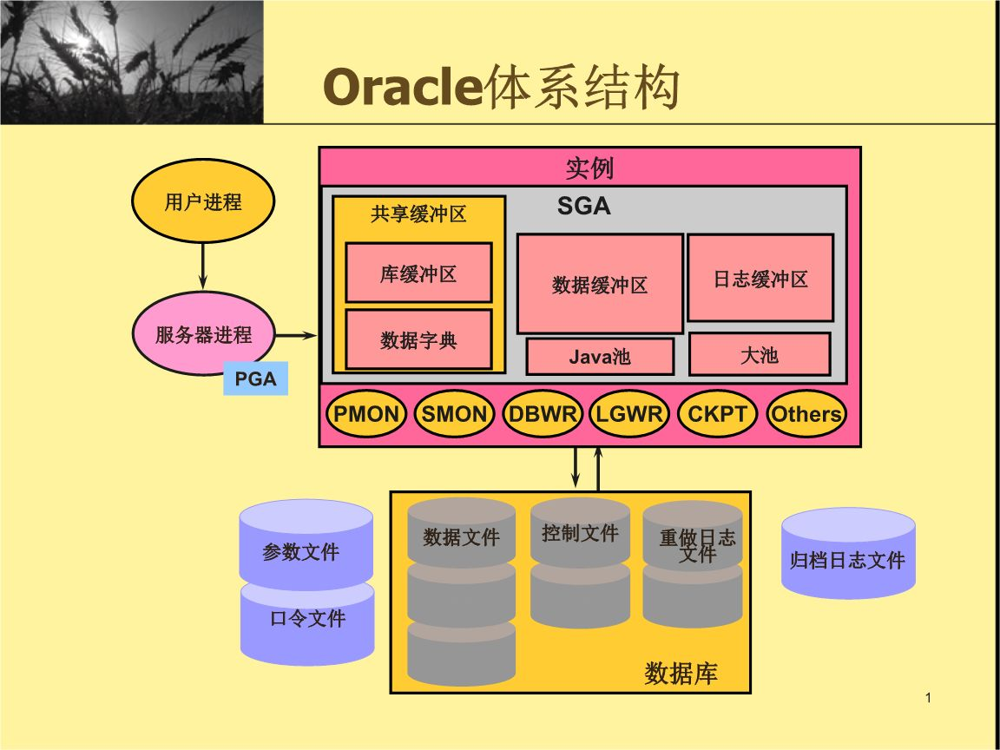

## 常用操作

### 去除全部空格 

```sql
SELECT TRIM('   11   ') aa FROM DUAL;
```

### 修改序列值
```sql
ALTER SEQUENCE 序列名 INCREMENT BY 4055;
ALTER SEQUENCE 序列名 INCREMENT BY -1;

SELECT 序列名.NEXTVAL FROM DUAL;
```
```sql
DROP SEQUENCE 序列名;
CREATE SEQUENCE 序列名 START WITH 1;
```

### 截取字符串
```sql
-- 格式1： 
-- a:截取字符串的开始位置（注：当a等于0或1时，都是从第一位开始截取）
-- b:要截取的字符串的长度
substr(string string, int a, int b);
-- 格式2：
-- a:可以理解为从第a个字符开始截取后面所有的字符串。
substr(string string, int a) ;
```

### 分组后统计各种条件的总数
```sql
SELECT GENDER,
       SUM(case when USER_TYPE = 1 then 1 else 0 end) USER_TYPE_1,
       SUM(case when USER_TYPE = 2 then 1 else 0 end) USER_TYPE_2,
       SUM(case when USER_TYPE = 3 then 1 else 0 end) USER_TYPE_3,
       SUM(case when USER_TYPE = 4 then 1 else 0 end) USER_TYPE_4
FROM USER
GROUP BY GENDER
```
参考：  
[https://blog.csdn.net/yangyansong789/article/details/80618320](https://blog.csdn.net/yangyansong789/article/details/80618320)  

### 分组后取第一条记录
```sql
select 查询内容
from (
         select row_number() over (partition by 分组字段 order by 排序字段) as rn, 查询字a, 查询字段b..
         from 表1, 表2
         where 条件
     )
where rn = 1;
```
```sql
select 查询内容
from (
         select row_number() over (partition by 分组字段 order by 排序字段) as xuhao, 查询字a, 查询字段b..
         from 表1 left join 表2
         on 条件
     )
where xuhao = 1;
```

### 保留两位小数
```sql
select trim(to_char(12.3, '9999999990.99')) from dual
```
参考：  
[https://blog.csdn.net/heweimingming/article/details/44176595?utm_source=blogxgwz9](https://blog.csdn.net/heweimingming/article/details/44176595?utm_source=blogxgwz9);

### 数据误删，获取最近1小时内的数据
```sql
select * from T_TABLE_NAME as of timestamp sysdate - interval '1' hour
```

### 计算日期相隔天数
```sql
-- TRUNC默认会截取为当天0点
SELECT TRUNC(SYSDATE) - TRUNC(SYSDATE) FROM DUAL
```
参考：  
[https://blog.csdn.net/qq_29171935/article/details/89478520](https://blog.csdn.net/qq_29171935/article/details/89478520)  
[https://www.cnblogs.com/mingforyou/p/7644308.html](https://www.cnblogs.com/mingforyou/p/7644308.html)  

### Date 转 VARCHAR
```sql
SELECT TO_CHAR(SYSDATE, 'YYYY-MM-DD HH24:MI:SS') FROM DUAL
```

### OVER(PARTITION BY... ORDER BY...)
参考：  
[https://blog.csdn.net/fygkchina/article/details/80521550](https://blog.csdn.net/fygkchina/article/details/80521550)  

## issue

### ORA-28001:口令已经失效

WINDOWS下使用DOS命令行连接oracle数据库  
sqlplus userName/userPassword@netServiceName

```
Oracle报错，ORA-28001: 口令已经失效
```

cmd命令行输入：

```
sqlplus / as sysdba
SQL*Plus: Release 11.2.0.1.0 Production on 星期二 10月 17 15:42:58 2017
Copyright (c) 1982, 2010, Oracle.  All rights reserved.
连接到:
Oracle Database 11g Enterprise Edition Release 11.2.0.1.0 - Production
With the Partitioning, OLAP, Data Mining and Real Application Testing options
SQL> ALTER PROFILE DEFAULT LIMIT PASSWORD_LIFE_TIME UNLIMITED;
配置文件已更改
SQL> alter user 用户名 dentified by 密码 account unlock;
用户已更改。
```

再次测试登录即可

### 解决SqlPlus前台程序出现中文乱码的问题

**第一步：**

```
在sqlplus中执行 select userenv('language') from dual;查看当前数据库的字符集为：SIMPLIFIED CHINESE_CHINA.ZHS16GBK。
我们只需要把客户端字符集和操作系统字符集都设置成这个就行了
开始-运行-CMD：
SET NLS_LANG=SIMPLIFIED CHINESE_CHINA.ZHS16GBK
以上参数设置只是在当前会话生效
```

**第二步：**

```
在环境变量中查找一个名为“NLS_LANG”的环境变量，如果找不到，则新建一个，
把变量值赋值为：“SIMPLIFIED CHINESE_CHINA.ZHS16GBK”
```

参考：  
[http://blog.itpub.net/26839123/viewspace-722870/](http://blog.itpub.net/26839123/viewspace-722870/)  

### 通过 sql developer 导出脚本

  
  

### Oracle账号

用户名：541509124@qq.com
密码：LR4ever.1314

参考：  
[https://blog.csdn.net/dengxt/article/details/81536099](https://blog.csdn.net/dengxt/article/details/81536099)  

## OCP-体系结构

### 工具使用
- sqlplus
- pl/sql
- develop
- sqldevelop
- toad
- ......

### 访问数据库的方式
- 本机直接通过sock方式访问（IPC）
```
sqlplus / as sysdba
```
- 通过TCP建立连接到Oracle服务器&Oracle网络配置

 方式一：
```
// ora10g -->必须在 $ORACLE_HOME/network/admin/tnsnames.ora配置出如何访问到远程数据库服务器
tnsping ora10g
sqlplus sys/oracle@ora10g as sysdba
```

  方式二：
```
// 不需要任何配置，但oracle服务器必须在listener.ora定义被远程访问的方式
sqlplus sys/oracle@ip:1521/ora10g as sysdba
```

### 数据库模型
1.专用型
一个进程一个会话
2.共享型

### 执行sql流程
- 能执行sql语句的程序或进程就是用户进程
- 用户进程 执行一个查询语句，比如select * from emp where empno=7839;
- 用户进程已经跟服务进程建立链接,服务器进程会响应用户进程,一些会话信息就会存储在内存（PGA）中,
把该用户进程的信息存储到PGA的UGA中。
- 语句经过PGA处理后传递给实例
- 实例中的共享池负责处理这条语句
- 库缓存区去判断语句如何分析--软分析或硬分析(以前是否执行过)
- sql语句操作的表在哪，表里面的行放在哪个block里面，所以需要数据字典
- 根据cbo得到的执行计划准备去执行语句，查询语句中的对象存放在哪个表空间的指定的行放在哪个块里
面，数据字典缓存区得到这些信息
- 开始执行
- 判断在数据缓存区data buffer cache中是否缓存需要的块
- 如果是，在内存读取数据得到所需行的结果返回给用户，用户看到这行的结果
如果没有，则服务器进程读取data file文件中对应的block到data buffer cache中，data buffer cache中的undo块用来做镜像，
undo缓存块会对该块做镜像，然后读该镜像中的数据得到行的结果，用户看到执行的结果，
- redo log buffer记录数据库中块的更改，修改前后的块（提交和未提交）都在undo块中做了镜像，意味着可以写入
磁盘与不可写入磁盘

- oracle做这么多就是为了尽可能用内存去操作，关系型数据库最重要的就是内存和磁盘
- 语句执行性能的高低，从shared pool中的library cache和data dict cache的命中率进行判断
- database buffer cache 命中率 关系到逻辑读（内存取数据）或物理读（磁盘取数据）
- redo log buffer 记录块的变化

- DBWR进程会将已提交的数据写到物理磁盘data file，只有当redo log buffer 将所有块的变更信息记录下来之后才会开始写
- 内存中的redo log 日志会定时通过LGWR写到磁盘Redo Log file(主要用于恢复)
- CKPT保证数据同步，一旦触发，DBWR就开始写数据，接着LGWR也开始写数据（比如手动commit）

- rdbms的实现的一套完整的解决方案
- 一个实例（内存结构和后台进程）和数据库（物理文件和文件的逻辑结构）构成了oracle服务器



用户进程产生的日志文件
```sql
show parameter user_
desc v$session v$process v$sql v$sqltext
```
```sql
select username,sid from v$session;
```

## PLSQL

### example
需求：读取TMP_MOBIWEB_PASSWORD表数据写入MOBILEWEB_SERVICE_NUMBER表，并进行相关校验
```sql
--打开输出
SET SERVEROUTPUT ON
DECLARE
    --获取临时表光标(过滤掉USER_NAME重复数据)
    CURSOR C_TMP_MOBIWEB_PASSWORD IS SELECT USER_NAME,
                                            MOBIWEB_PASSWORD,
                                            MOBILE_PAGE_PWD,
                                            SECURITY_QUESTON
                                     FROM TMP_MOBIWEB_PASSWORD
                                     WHERE USER_NAME NOT IN (SELECT USER_NAME
                                                             FROM TMP_MOBIWEB_PASSWORD
                                                             GROUP BY USER_NAME
                                                             HAVING COUNT(1) > 1);
    --定义插入字段变量
    ID                      MOBILEWEB_SERVICE_NUMBER.ID%TYPE;
    USER_NAME               MOBILEWEB_SERVICE_NUMBER.USER_NAME%TYPE;
    MOBIWEB_PASSWORD        MOBILEWEB_SERVICE_NUMBER.MOBIWEB_PASSWORD%TYPE;
    MOBILE_PAGE_PWD         MOBILEWEB_SERVICE_NUMBER.MOBILE_PAGE_PWD%TYPE;
    SECURITY_QUESTON        MOBILEWEB_SERVICE_NUMBER.SECURITY_QUESTON%TYPE;
    --定义输出打印字段变量
    OUTPUT_MOBILE_PAGE_PWD  MOBILEWEB_SERVICE_NUMBER.MOBILE_PAGE_PWD%TYPE;
    OUTPUT_SECURITY_QUESTON MOBILEWEB_SERVICE_NUMBER.SECURITY_QUESTON%TYPE;
    --获取临时表USER_NAME重复数据
    CURSOR C_USER_NAME_COUNT IS SELECT USER_NAME, COUNT(1) COUNT
                                FROM TMP_MOBIWEB_PASSWORD
                                GROUP BY USER_NAME
                                HAVING COUNT(1) > 1;
    --获取临时表USER_NAME或MOBIWEB_PASSWORD为空数据
    CURSOR C_COLUMN IS SELECT USER_NAME, MOBIWEB_PASSWORD
                       FROM TMP_MOBIWEB_PASSWORD
                       WHERE USER_NAME IS NULL
                          OR MOBIWEB_PASSWORD IS NULL;
    --成功、失败数量
    SUCCESS                 NUMBER := 0;
    FAILURE                 NUMBER := 0;
BEGIN
    DBMS_OUTPUT.ENABLE(buffer_size=>null);
    --清除-9999数据
    DELETE FROM MOBILEWEB_SERVICE_NUMBER WHERE CREATED_USER_ID = -9999;
    --遍历光标
    FOR CUR IN C_TMP_MOBIWEB_PASSWORD
        LOOP
            IF CUR.USER_NAME IS NOT NULL AND CUR.MOBIWEB_PASSWORD IS NOT NULL THEN
                --自增序列
                ID := S_MOBILEWEB_SERVICE_NUMBER.nextval;
                --执行插入
                INSERT INTO MOBILEWEB_SERVICE_NUMBER (ID, USER_NAME, MOBIWEB_PASSWORD, MOBILE_PAGE_PWD,
                                                      SECURITY_QUESTON,
                                                      CREATED_USER_ID)
                VALUES (ID, CUR.USER_NAME, CUR.MOBIWEB_PASSWORD, CUR.MOBILE_PAGE_PWD, CUR.SECURITY_QUESTON, -9999);
                SUCCESS := SUCCESS + 1;
                --输出执行语句
                IF MOBILE_PAGE_PWD IS NOT NULL THEN
                    OUTPUT_MOBILE_PAGE_PWD := '' || MOBILE_PAGE_PWD || '';
                ELSE
                    OUTPUT_MOBILE_PAGE_PWD := 'null';
                END IF;
                IF SECURITY_QUESTON IS NOT NULL THEN
                    OUTPUT_SECURITY_QUESTON := '''' || SECURITY_QUESTON || '''';
                ELSE
                    OUTPUT_SECURITY_QUESTON := 'null';
                END IF;
--                DBMS_OUTPUT.PUT_LINE(
--                            ''''INSERT INTO MOBILEWEB_SERVICE_NUMBER (ID, USER_NAME, MOBIWEB_PASSWORD, MOBILE_PAGE_PWD, SECURITY_QUESTON, CREATED_USER_ID) VALUES ('''' ||
--                            ID || '''', '''''''''''' || CUR.USER_NAME || '''''''''''', '''''''''''' || CUR.MOBIWEB_PASSWORD || '''''''''''', '''' ||
--                            OUTPUT_MOBILE_PAGE_PWD || '''', '''' || OUTPUT_SECURITY_QUESTON || '''', -9999);'''');
            END IF;
        END LOOP;
    --遍历光标
    FOR CUR IN C_USER_NAME_COUNT
        LOOP
            FAILURE := FAILURE + CUR.COUNT;
            --输出异常
            DBMS_OUTPUT.PUT_LINE('USER_NAME重複:' || CUR.USER_NAME || ', 數量:' || CUR.COUNT);
        END LOOP;
    --遍历光标
    FOR CUR IN C_COLUMN
        LOOP
            FAILURE := FAILURE + 1;
            --输出异常
            DBMS_OUTPUT.PUT_LINE(
                    'USER_NAME為空或MOBIWEB_PASSWORD為空-> USER_NAME:' || CUR.USER_NAME || ', MOBIWEB_PASSWORD:' ||
                        CUR.MOBIWEB_PASSWORD);
        END LOOP;
    --输出结果
    DBMS_OUTPUT.PUT_LINE('成功:' || SUCCESS || ', 失敗:' || FAILURE);
    --需要提交
    COMMIT;
END ;
```

需求：创建存储过程进行数据插入
```sql
CREATE OR REPLACE PROCEDURE portal_addUser (userName IN VARCHAR2, account IN VARCHAR2, roleCodes IN VARCHAR2)
AS
    id int;
BEGIN
    --初始化id
    id:=S_BASE_USER.nextval;
    --添加user
    INSERT INTO BASE_USER (ID, USER_NAME, PASSWORD, USER_TYPE, EMAIL, MOBILE, ACCOUNT, APPROVAL_FLAG, BIZ_ID, EXTEND_ATTRIBUTES, FORCE_CHANGE_PASSWORD_FLAG, PASSWORD_EXPIRE_DATE, NEXT_CHANGE_PASSWORD_DATE, NEXT_CHANGE_ALERT_DATE, APP_NAME, CREATED_USER_ID, CREATE_DATE, UPDATED_USER_ID, UPDATE_DATE, STATUS, ACTIVE_FLAG) VALUES (id, userName, 'F94E4B90C3054C309B9A0BDFC2186A45256582', 'InnerUser', null, null, account, null, null, null, null, null, null, null, 'portal', 22, SYSDATE, 22, SYSDATE, 1, 1);
    declare
        --将roleCodes转为table,并获取其光标
        cursor c_roleCodes is SELECT REGEXP_SUBSTR (roleCodes, '[^,]+', 1, rownum) as roleCode
                              from dual connect by rownum<=LENGTH (roleCodes) - LENGTH (regexp_replace(roleCodes, ',', ''))+1;
        --roleCode
        proleCode VARCHAR2(1000);
    begin
        --打开光标
        open c_roleCodes;
        loop
            fetch c_roleCodes into proleCode;
            exit when c_roleCodes%notfound;
            INSERT INTO BASE_SCY_USER_R_ROLE (ID, USER_ID, ROLE_CODE, ROLE_TYPE, APP_NAME, CREATED_USER_ID, CREATE_DATE, UPDATED_USER_ID, UPDATE_DATE, STATUS) VALUES (S_BASE_SCY_USER_R_ROLE.nextval, id, proleCode, null, null, 22, SYSDATE, null, null, 1);
        end loop;
        --关闭光标
        close c_roleCodes;
    end;
END portal_addUser;
```
```sql
begin
    PORTAL_ADDUSER('userName', 'account', 'roleCode1,roleCode2');
end;
```