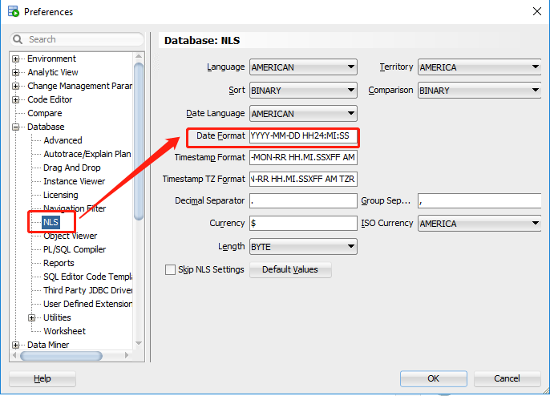
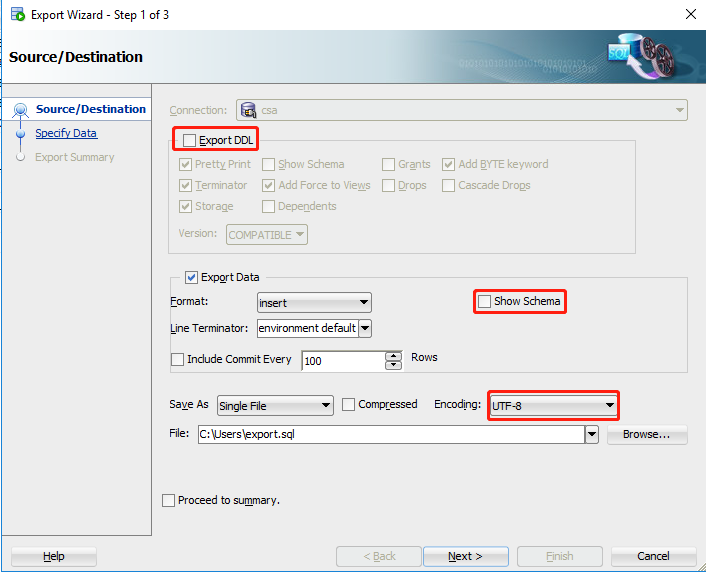

## 字符串
**去除全部空格**
```sql
SELECT TRIM('   11   ') aa FROM DUAL;
```
**截取字符串**
```sql
-- 格式1： 
-- a:截取字符串的开始位置（注：当a等于0或1时，都是从第一位开始截取）
-- b:要截取的字符串的长度
substr(string string, int a, int b);
-- 格式2：
-- a:可以理解为从第a个字符开始截取后面所有的字符串。
substr(string string, int a) ;
```

<br>

## 序列
**修改序列值**
```sql
ALTER SEQUENCE 序列名 INCREMENT BY 4055;
ALTER SEQUENCE 序列名 INCREMENT BY -1;

SELECT 序列名.NEXTVAL FROM DUAL;
```
```sql
DROP SEQUENCE 序列名;
CREATE SEQUENCE 序列名 START WITH 1;
```

<br>

## 分组
**分组后统计各种条件的总数**
```sql
SELECT GENDER,
       SUM(case when USER_TYPE = 1 then 1 else 0 end) USER_TYPE_1,
       SUM(case when USER_TYPE = 2 then 1 else 0 end) USER_TYPE_2,
       SUM(case when USER_TYPE = 3 then 1 else 0 end) USER_TYPE_3,
       SUM(case when USER_TYPE = 4 then 1 else 0 end) USER_TYPE_4
FROM USER
GROUP BY GENDER
```
**分组后取第一条记录**
```sql
select 查询内容
from (
         select row_number() over (partition by 分组字段 order by 排序字段) as rn, 查询字a, 查询字段b..
         from 表1, 表2
         where 条件
     )
where rn = 1;
```
```sql
select 查询内容
from (
         select row_number() over (partition by 分组字段 order by 排序字段) as xuhao, 查询字a, 查询字段b..
         from 表1 left join 表2
         on 条件
     )
where xuhao = 1;
```
**分组后排序**
```sql
OVER(PARTITION BY... ORDER BY...)
```

<br>

## 数字
**保留两位小数**
```sql
select trim(to_char(12.3, '9999999990.99')) from dual
```

<br>

## 日期时间
**计算日期相隔天数**
```sql
-- TRUNC默认会截取为当天0点
SELECT TRUNC(SYSDATE) - TRUNC(SYSDATE) FROM DUAL
```
**Date转VARCHAR**
```sql
SELECT TO_CHAR(SYSDATE, 'YYYY-MM-DD HH24:MI:SS') FROM DUAL
```

<br>

## PLSQL

**example**  
需求：读取TMP_MOBIWEB_PASSWORD表数据写入MOBILEWEB_SERVICE_NUMBER表，并进行相关校验
```sql
--打开输出
SET SERVEROUTPUT ON
DECLARE
    --获取临时表光标(过滤掉USER_NAME重复数据)
    CURSOR C_TMP_MOBIWEB_PASSWORD IS SELECT USER_NAME,
                                            MOBIWEB_PASSWORD,
                                            MOBILE_PAGE_PWD,
                                            SECURITY_QUESTON
                                     FROM TMP_MOBIWEB_PASSWORD
                                     WHERE USER_NAME NOT IN (SELECT USER_NAME
                                                             FROM TMP_MOBIWEB_PASSWORD
                                                             GROUP BY USER_NAME
                                                             HAVING COUNT(1) > 1);
    --定义插入字段变量
    ID                      MOBILEWEB_SERVICE_NUMBER.ID%TYPE;
    USER_NAME               MOBILEWEB_SERVICE_NUMBER.USER_NAME%TYPE;
    MOBIWEB_PASSWORD        MOBILEWEB_SERVICE_NUMBER.MOBIWEB_PASSWORD%TYPE;
    MOBILE_PAGE_PWD         MOBILEWEB_SERVICE_NUMBER.MOBILE_PAGE_PWD%TYPE;
    SECURITY_QUESTON        MOBILEWEB_SERVICE_NUMBER.SECURITY_QUESTON%TYPE;
    --定义输出打印字段变量
    OUTPUT_MOBILE_PAGE_PWD  MOBILEWEB_SERVICE_NUMBER.MOBILE_PAGE_PWD%TYPE;
    OUTPUT_SECURITY_QUESTON MOBILEWEB_SERVICE_NUMBER.SECURITY_QUESTON%TYPE;
    --获取临时表USER_NAME重复数据
    CURSOR C_USER_NAME_COUNT IS SELECT USER_NAME, COUNT(1) COUNT
                                FROM TMP_MOBIWEB_PASSWORD
                                GROUP BY USER_NAME
                                HAVING COUNT(1) > 1;
    --获取临时表USER_NAME或MOBIWEB_PASSWORD为空数据
    CURSOR C_COLUMN IS SELECT USER_NAME, MOBIWEB_PASSWORD
                       FROM TMP_MOBIWEB_PASSWORD
                       WHERE USER_NAME IS NULL
                          OR MOBIWEB_PASSWORD IS NULL;
    --成功、失败数量
    SUCCESS                 NUMBER := 0;
    FAILURE                 NUMBER := 0;
BEGIN
    DBMS_OUTPUT.ENABLE(buffer_size=>null);
    --清除-9999数据
    DELETE FROM MOBILEWEB_SERVICE_NUMBER WHERE CREATED_USER_ID = -9999;
    --遍历光标
    FOR CUR IN C_TMP_MOBIWEB_PASSWORD
        LOOP
            IF CUR.USER_NAME IS NOT NULL AND CUR.MOBIWEB_PASSWORD IS NOT NULL THEN
                --自增序列
                ID := S_MOBILEWEB_SERVICE_NUMBER.nextval;
                --执行插入
                INSERT INTO MOBILEWEB_SERVICE_NUMBER (ID, USER_NAME, MOBIWEB_PASSWORD, MOBILE_PAGE_PWD,
                                                      SECURITY_QUESTON,
                                                      CREATED_USER_ID)
                VALUES (ID, CUR.USER_NAME, CUR.MOBIWEB_PASSWORD, CUR.MOBILE_PAGE_PWD, CUR.SECURITY_QUESTON, -9999);
                SUCCESS := SUCCESS + 1;
                --输出执行语句
                IF MOBILE_PAGE_PWD IS NOT NULL THEN
                    OUTPUT_MOBILE_PAGE_PWD := '' || MOBILE_PAGE_PWD || '';
                ELSE
                    OUTPUT_MOBILE_PAGE_PWD := 'null';
                END IF;
                IF SECURITY_QUESTON IS NOT NULL THEN
                    OUTPUT_SECURITY_QUESTON := '''' || SECURITY_QUESTON || '''';
                ELSE
                    OUTPUT_SECURITY_QUESTON := 'null';
                END IF;
--                DBMS_OUTPUT.PUT_LINE(
--                            ''''INSERT INTO MOBILEWEB_SERVICE_NUMBER (ID, USER_NAME, MOBIWEB_PASSWORD, MOBILE_PAGE_PWD, SECURITY_QUESTON, CREATED_USER_ID) VALUES ('''' ||
--                            ID || '''', '''''''''''' || CUR.USER_NAME || '''''''''''', '''''''''''' || CUR.MOBIWEB_PASSWORD || '''''''''''', '''' ||
--                            OUTPUT_MOBILE_PAGE_PWD || '''', '''' || OUTPUT_SECURITY_QUESTON || '''', -9999);'''');
            END IF;
        END LOOP;
    --遍历光标
    FOR CUR IN C_USER_NAME_COUNT
        LOOP
            FAILURE := FAILURE + CUR.COUNT;
            --输出异常
            DBMS_OUTPUT.PUT_LINE('USER_NAME重複:' || CUR.USER_NAME || ', 數量:' || CUR.COUNT);
        END LOOP;
    --遍历光标
    FOR CUR IN C_COLUMN
        LOOP
            FAILURE := FAILURE + 1;
            --输出异常
            DBMS_OUTPUT.PUT_LINE(
                    'USER_NAME為空或MOBIWEB_PASSWORD為空-> USER_NAME:' || CUR.USER_NAME || ', MOBIWEB_PASSWORD:' ||
                        CUR.MOBIWEB_PASSWORD);
        END LOOP;
    --输出结果
    DBMS_OUTPUT.PUT_LINE('成功:' || SUCCESS || ', 失敗:' || FAILURE);
    --需要提交
    COMMIT;
END ;
```
需求：创建存储过程进行数据插入
```sql
CREATE OR REPLACE PROCEDURE portal_addUser (userName IN VARCHAR2, account IN VARCHAR2, roleCodes IN VARCHAR2)
AS
    id int;
BEGIN
    --初始化id
    id:=S_BASE_USER.nextval;
    --添加user
    INSERT INTO BASE_USER (ID, USER_NAME, PASSWORD, USER_TYPE, EMAIL, MOBILE, ACCOUNT, APPROVAL_FLAG, BIZ_ID, EXTEND_ATTRIBUTES, FORCE_CHANGE_PASSWORD_FLAG, PASSWORD_EXPIRE_DATE, NEXT_CHANGE_PASSWORD_DATE, NEXT_CHANGE_ALERT_DATE, APP_NAME, CREATED_USER_ID, CREATE_DATE, UPDATED_USER_ID, UPDATE_DATE, STATUS, ACTIVE_FLAG) VALUES (id, userName, 'F94E4B90C3054C309B9A0BDFC2186A45256582', 'InnerUser', null, null, account, null, null, null, null, null, null, null, 'portal', 22, SYSDATE, 22, SYSDATE, 1, 1);
    declare
        --将roleCodes转为table,并获取其光标
        cursor c_roleCodes is SELECT REGEXP_SUBSTR (roleCodes, '[^,]+', 1, rownum) as roleCode
                              from dual connect by rownum<=LENGTH (roleCodes) - LENGTH (regexp_replace(roleCodes, ',', ''))+1;
        --roleCode
        proleCode VARCHAR2(1000);
    begin
        --打开光标
        open c_roleCodes;
        loop
            fetch c_roleCodes into proleCode;
            exit when c_roleCodes%notfound;
            INSERT INTO BASE_SCY_USER_R_ROLE (ID, USER_ID, ROLE_CODE, ROLE_TYPE, APP_NAME, CREATED_USER_ID, CREATE_DATE, UPDATED_USER_ID, UPDATE_DATE, STATUS) VALUES (S_BASE_SCY_USER_R_ROLE.nextval, id, proleCode, null, null, 22, SYSDATE, null, null, 1);
        end loop;
        --关闭光标
        close c_roleCodes;
    end;
END portal_addUser;
```
```sql
begin
    PORTAL_ADDUSER('userName', 'account', 'roleCode1,roleCode2');
end;
```

<br>

## 工具
**通过sql developer导出脚本**
  


<br>

## 运维
**数据误删，获取最近1小时内的数据**
```sql
select * from T_TABLE_NAME as of timestamp sysdate - interval '1' hour
```

<br>

## 其它问题
**ORA-28001:口令已经失效**
> Windows下使用DOS命令行连接oracle数据库，`sqlplus userName/userPassword@netServiceName`，报ORA-28001: 口令已经失效

解决：
> sqlplus / as sysdba  
> SQL*Plus: Release 11.2.0.1.0 Production on 星期二 10月 17 15:42:58 2017  
> Copyright (c) 1982, 2010, Oracle.  All rights reserved.  
> 连接到:  
> Oracle Database 11g Enterprise Edition Release 11.2.0.1.0 - Production  
> With the Partitioning, OLAP, Data Mining and Real Application Testing options  
> SQL> ALTER PROFILE DEFAULT LIMIT PASSWORD_LIFE_TIME UNLIMITED;  
> 配置文件已更改  
> SQL> alter user 用户名 dentified by 密码 account unlock;  
> 用户已更改。

再次测试登录即可  

**SqlPlus前台程序出现中文乱码**
1. 查看数据库字符集  
   在sqlplus中执行 `select userenv('language') from dual;`查看当前数据库的字符集为：`SIMPLIFIED CHINESE_CHINA.ZHS16GBK`。
   我们只需要把客户端字符集和操作系统字符集都设置成这个就行了
   在命令行中执行`SET NLS_LANG=SIMPLIFIED CHINESE_CHINA.ZHS16GBK`。
   以上参数设置只是在当前会话生效
2. 设置客户端字符集
   在环境变量中查找一个名为`NLS_LANG`的环境变量，如果找不到，则新建一个，
   再把变量值赋值为`SIMPLIFIED CHINESE_CHINA.ZHS16GBK`

详情见：[http://blog.itpub.net/26839123/viewspace-722870/](http://blog.itpub.net/26839123/viewspace-722870/)  
