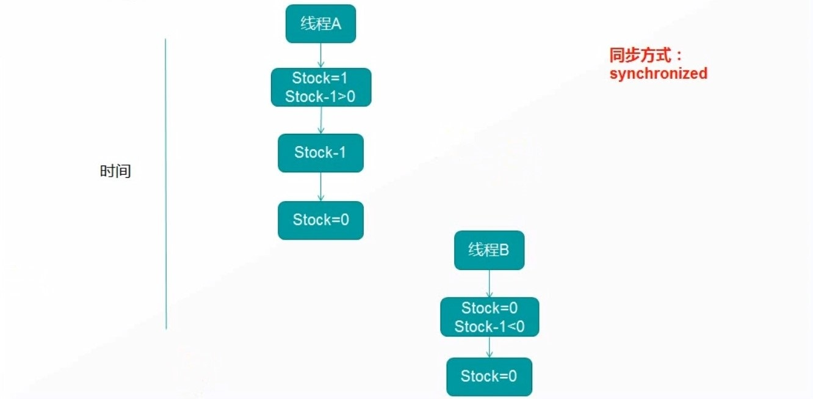
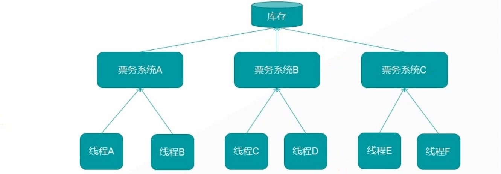
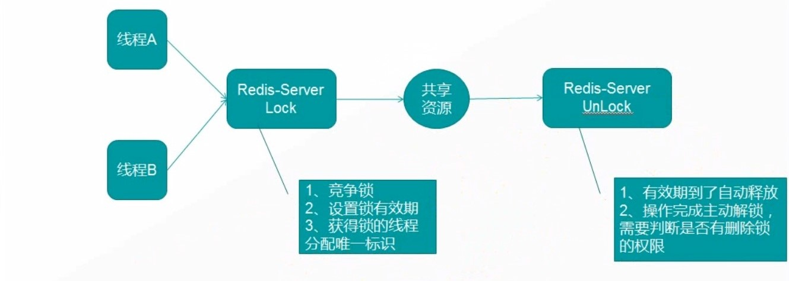
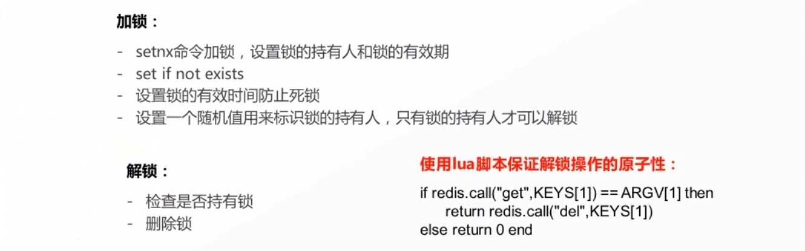
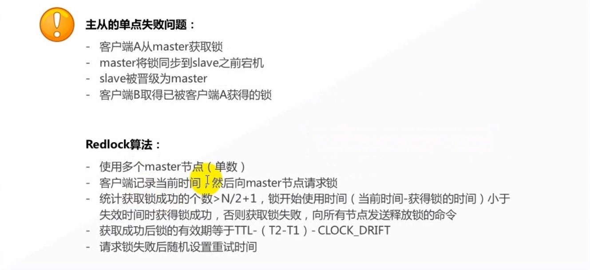

## 介绍(一)

### 锁的基本概念

#### 超卖案例


#### 超卖的根源

#### 线程安全

#### 同步


#### 锁的性能优化
- 缩短锁持有的时间
- 减小锁的粒度
- 锁分离


#### 锁种类
- 公平锁，synchronized、ReentrantLock
- 非公平锁，ReentrantLock、CAS
- 独享锁，synchronized、ReentrantLock
- 共享锁，Semaphore

### 分布式锁
#### 分布式环境

#### 分布式锁的注意事项
- 互斥锁(独享锁)
在任意时刻只有一个客户端可以获取锁

- 防死锁
即使有一个客户端在持有锁的期间奔溃而没有主动解锁，也能保证后续其他客户端能加锁

- 持锁人解锁
加锁和解锁必须是同一个客户端，客户端自己不能把别人加的锁给解了

- 可重入
当一个客户端获取对象锁之后，这个客户端可以再次获取本对象上的锁

#### Redis分布式锁流程图

#### Redis分布式锁算法
redis.script：
```
if redis.call("get", KEYS[1]) == ARGV[1] then
    return redis.call("del", KEYS[1])
else
    return 0
end
```



#### Readlock算法



#### 基于数据库的分布式锁
实现方式：
- 新建一张锁表
- 获取锁时插入一条数据
- 解锁时删除数据

主要问题:
- 可用性差，数据库挂掉会导致业务系统不可用，连接数量有限
- 锁的失效时间难以控制，容易造成死锁

#### 基于zk的分布式锁
实现方式:
每个客户端对某个方法加锁时，在zookeeper上的与该方法对应的指定节点的目录下，生成一个唯一的临时有序节点。判断是否获取锁的方式很简单，只需要判断有序节点中序号最小的一个。
当释放锁的时候，只需将这个临时节点删除即可。同时，其可以避免服务宕机导致的锁无法释放，而产生的死锁问题。

主要问题:
- 性能一般，加减锁时需要通过Leader创建或删除临时节点

#### 各种分布式锁比较
哪种方式都无法做到完美。就像CAP一样，在复杂性、可靠性、性能等方面无法同时满足，所以根据不同的应用场景选择最合适自己的方案。

- 从理解的难易程度角度
数据库 > 缓存 > Zookeeper

- 从实现的复杂性角度
Zookeeper > 缓存 > 数据库

- 从性能角度
缓存 > Zookeeper > 数据库

- 从可靠性角度
Zookeeper > 缓存 > 数据库
