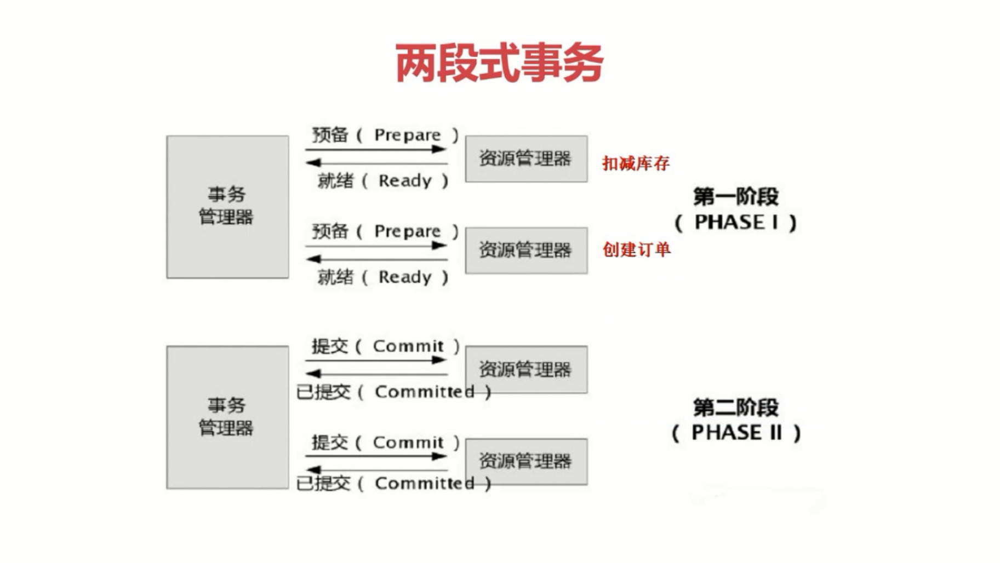
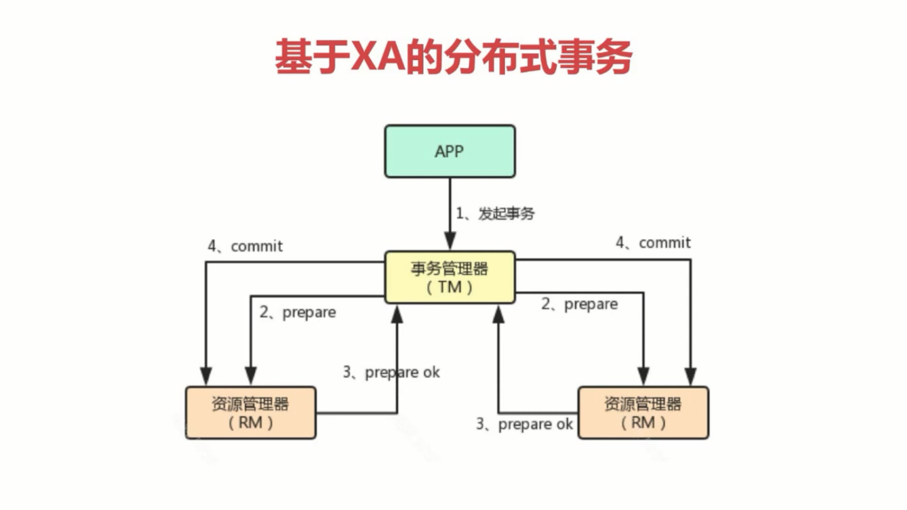
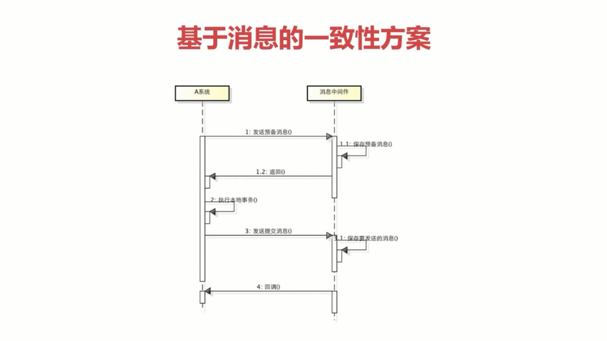
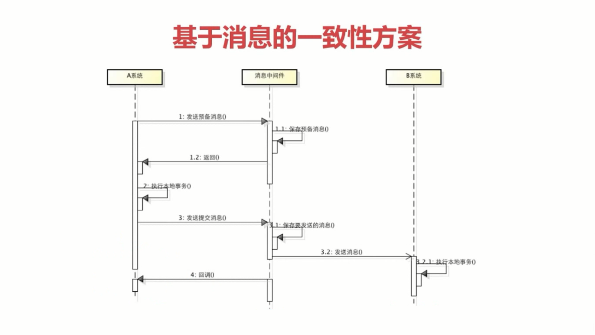
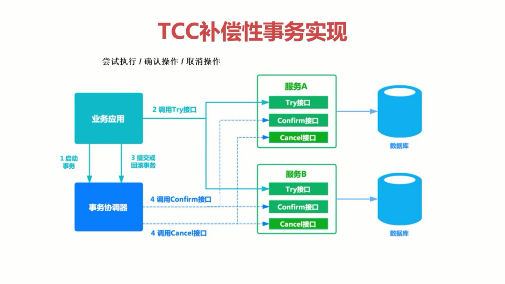

## 事务简介
### 事务简介
- 事务是用来保证一组数据操作的完整性和一致性
扣减库存、下订单、支付
- 事务必须满足ACID的四大特性
- 事务具有四种隔离级别
- 事务具有七种传播行为

### 事务属性
- 原子性（Atomicity）
- 一致性（Consistency）
- 隔离性（Isolation）
- 持久性（Durability）

## 概念
- 分布式事务就是将多个节点的事务看成一个整体处理
- 分布式事务由事务参与者、资源服务器、事务管理器等组成
- 常见的分布式事务的例子：支付、下订单等

## 实现思路
### 两段式事务和三段式事务

### 基于XA的分布式事务

### 基于消息的最终一致性方案

### TCC编程式补偿性事务

## 两种事务比较
- 基于消息事务是强一致性事务，会存在资源浪费
- TCC事务是柔性事务，在try阶段要对资源做预留
- TCC事务在确认或取消阶段释放资源
- 与基于消息事务对比，TCC的时效性更好

## 分布式事务框架
- 全局事务服务（Global Transaction Service，简称GTS）
- 蚂蚁金服分布式事务（Distributed Transaction-eXtended，简称DTX）
- 开源TCC框架（TCC-Transaction）
- 开源TCC框架（ByteTCC）