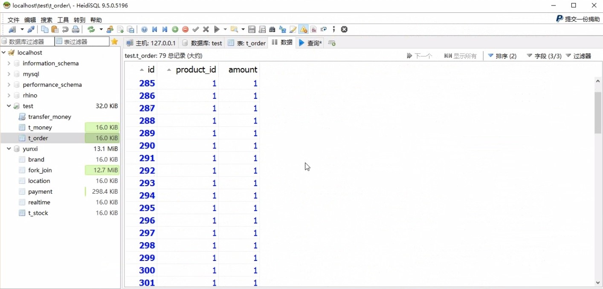

## 关于事务
### 什么是事务
事务是一种机制，是单个的工作单元。  
用来将一系列数据库更改归入一个逻辑操作单元。逻辑操作中所做的更改作为一个单元进行提交或取消。  


### 为什么要使用事务
转账流程:  
1. 李雷减去1000元  
2. 韩梅梅加1000元  
3. 完成转账  

```sql
update table set money = money - 1000 where user_id = '李雷' and money - 1000 > 0;
update table set money = money + 1000 where user_id = '韩梅梅';
```


- 使用事务的目的：解决数据安全操作(一致性)

### 事务的三种模式
- 自动提交事务
每条单独的语句都是一个事务，执行成功自动提交
```sql
BEGIN
  /*从李雷的账户扣钱*/
  update t_money set money = money - 1000 where id = 1 and money - 1000 > 0;
  /*从韩梅梅的账户加钱*/
  update t_money set money = money + 1000 where id = 2;
END 
```

```sql
BEGIN
  /*临时变量用来存储更新条数*/
  declare rowcount tinyint default 0;
  /*从李雷的账户扣钱*/
  update t_money set money = money - 1000 where id = 1 and money - 1000 > 0;
  select row_count() into rowcount;
  /*从韩梅梅的账户加钱*/
  update t_money set money = money + 1000 where id = 2;
  if rowcount = 0 then
    rollback;
  else 
    commit;
  end if
END 
```


- 显示事务
每个事务均以BEGIN TRANSACTION语句显式开始，以COMMIT或ROLLBACK语句显式结束
```sql
BEGIN
  /*临时变量用来存储更新条数*/
  declare rowcount tinyint default 0;
  /*开启事务*/
  start transaction;
  /*从李雷的账户扣钱*/
  update t_money set money = money - 1000 where id = 1 and money - 1000 > 0;
  select row_count() into rowcount;
  /*从韩梅梅的账户加钱*/
  update t_money set money = money + 1000 where id = 2;
  if rowcount = 0 then
    rollback;
  else 
    commit;
  end if
END 
```
- 隐形事务
和自动提交模式有点类似，但是很明显的区别是：无论单个SQL语句执行成功与否，都需要手动提交或回滚  

### 事务的ACID
原子性(Atomicity): 对于其数据修改，要么全都执行，要么全都不执行  
一致性(Consistency): 事务开始前和结束后，必须使所有的数据都保持一致状态  
隔离性(Isolation): 同一时间只允许一个事务请求同一数据，不同的事务之间彼此没有任何干扰  
持久性(Durability): 事务完成后，事务对数据库的所有更新将被保存到数据库  

### 场景一
#### 多个部门，多个资源服务器(DB Server)  
- 订单部门
- 支付部门
- 物流部门


处理TB级别的数据库：Teradata、Greenplum

### 场景二
#### 在淘宝/京东进行网购  
- 用户支付
- 支付宝扣款
- 支付完成或者失败

业务流程：


### Java事务的三大类型
- JTA事务
在两个或多个网络计算机资源上访问并且更新数据，这些数据可以分布在多个数据库上
- 容器事务(WebLogic、JBoss)
容器事务主要是J2EE应用服务器提供的，容器事务大多是基于JTA完成，这是一个基于JNDI的，相当复杂的API实现  
- JDBC事务
基于Connection对象控制的事务，JDBC事务控制的局限性在一个数据库连接内

## 代码实现
### 什么是分布式事务
分布式事务就是指事务的参与者、支持者的服务器、资源服务器以及事务管理器分别位于不同的分布式系统的不同节点之上。  

Java事务API(简称JTA)是一个Java企业版的应用程序接口。在Java环境中，允许完成跨越多个XA资源的分布式事务。

### XA规范
#### X/Open 组织（即现在的Open Group）定义了分布式事务处理模型
- 应用程序
- 事务管理器：协调者。承担所有事务参与单元的协调与通知
- 资源管理器：数据库
- 通信资源管理器：消息

### Spring + Tomcat + JTA实现
- Atomikos
- Jtom
- Bitronix


### Spring事务的三种方式
- 注解式：Transactional
- 事务模板式：TransactionTemplate
- 编程式：JTATransactionManager





## 关于一致性


