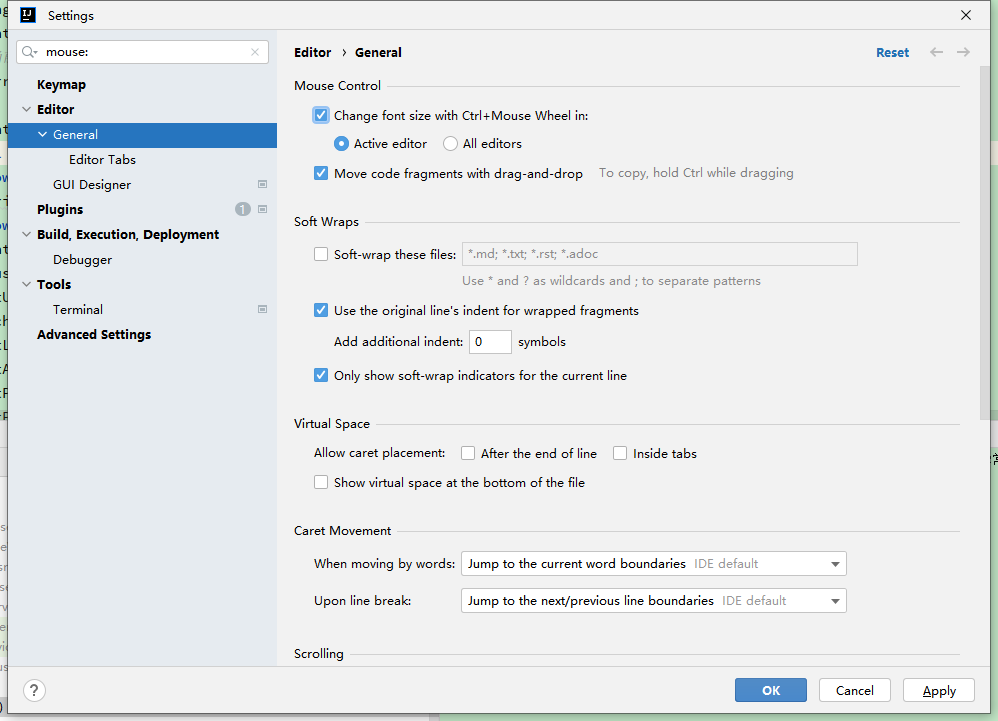
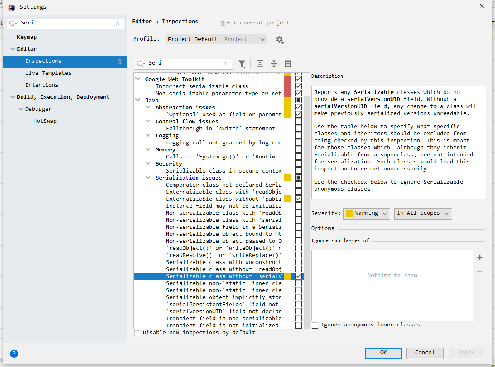
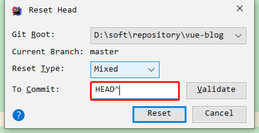

## 修改编码UTF8

## 设置maven

## 设置打开的文件栏多行显示
```
settings—Editor—General—Editor Tabs—取消勾选Show tabs in one row
```

## 切换风格
```
settings—Appearance & Behavior—Appearance—Theme—点击切换
```

## 设置护眼
```
settings—Editor—Color Scheme—General—Text—Default text—点击"Background"所对应的颜色框—R: 199,  G:237, B:204
```

## 切换字体
```
settings—Editor—Font—选择 source code pro
```

## 自动删除类中无用的import包
```
settings—Editor—General—Auto Import—勾选Optimize imports on the fly
```

## 代码提示区分大小写
```
settings—Editor—General—Code Completion—取消勾选Match case
```

## 鼠标滚动缩放字体大小


## 自动生成serialVersionUID


## 常用插件
- Translate
- SonarLint  
参考:  
[https://segmentfault.com/a/1190000019859084?utm_source=tag-newest](https://segmentfault.com/a/1190000019859084?utm_source=tag-newest)  
[https://blog.csdn.net/amethystcity/article/details/82989231](https://blog.csdn.net/amethystcity/article/details/82989231)  

- RestfulToolkit
- Maven Helper
- Lombok
- GsonFormat
- Free MyBatis plugin
- Codota
- Json Parser
- any-rule
- SequenceDiagram

- Elasticsearch  
参考:  
[https://plugins.jetbrains.com/plugin/14512-elasticsearch](https://plugins.jetbrains.com/plugin/14512-elasticsearch)  
[https://www.intellij-elasticsearch.com/](https://www.intellij-elasticsearch.com/)  

## 常用快捷键
```properties
大小写切换: ctr+shift+u
```

## 还原commit
  
参考：  
[https://jingyan.baidu.com/article/15622f24ca2faafdfcbea58b.html](https://jingyan.baidu.com/article/15622f24ca2faafdfcbea58b.html)  
