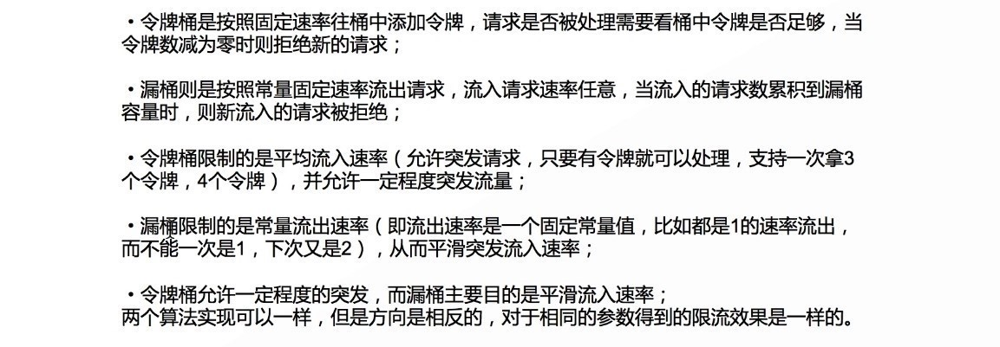

## 限流场景
- 12306
- 双十一（11.11零点，由于各种商家的促销活动(前XX名免单)，支付宝进入排队支付状态）
- 外卖业务

## 常见的限流方案
### 手动实现负载均衡

### 验证码
12306故意把验证码弄的模糊不清，影响消费者下单，从而限流

### 容器限流
- 以Tomcat容器为例，其Connector其中一种配置有如下几个参数
- acceptCount：如果Tomcat的线程都忙于响应，新来的连接会进入队列排队，如果超出排队大小，则拒绝连接
- maxConnections：瞬时最大连接数，超出的会排队等待
- maxThreads：Tomcat能用来处理请求的最大线程数，如果请求处理量一直远远大于最大线程数则可能会僵死
### 限流总资源数
如果有的资源是稀缺资源(如数据库连接、线程)，而且可能有多个系统都会去使用它，那么需要限制应用  
可以使用池化技术来限制总资源数：连接池、线程池  
比如分配给每个应用的数据库连接是100  
那么本应用最多可以使用100个资源，超出了可以等待或者抛异常
### 限流某个接口的总并发/请求数
如果接口可能会有突发访问情况，但又担心访问量太大造成崩溃，如抢购业务；  
这个时候就需要限制这个接口的总并发请求数了；  
因为粒度比较细，可以为每个接口都设置相应的阈值。可以使用Java中的AtomicLong进行限流
```java
try {
    if (atomic.incrementAndGet() > 限流数) {
        // 拒绝请求
    }
    // 处理请求
} finally {
    atomic.decrementAndGet();
}
```
### Nginx限流
Nginx提供了一个叫ngx_http_limit_req_module的模块进行流量控制

### 消息队列
通过RabbitMQ，RocketMQ，ActiveMQ，ZeroMQ，Kafka把流量做均匀，限制高流量涌入

### 利用Netflix的Hystrix限流


##  Guava是什么
Guava是一个Google开发的基于java的类库集合的扩展项目，包括collectiions，caching，primitives support，concurrency libraries，common annotations，string processing，I/O等等，这些高质量的API可以使你的JAVA代码更加优雅，更加简洁，让你工作更加轻松愉快  
限流的概念


##  Guava限流核心算法
漏桶算法


令牌桶算法


比较


##  Guava限流实战
Guava RateLimiter实现平滑限流
-  **平滑突发限流(SmoothBursty)**

```java
import com.google.common.util.concurrent.RateLimiter;

/**
 * @Description 平滑突发限流(SmoothBursty)
 */
public class SmoothBurstyRateLimitTest01 {

    public static void main(String[] args) {
        //每秒允许5个请求，表示桶容量为5且每秒新增5个令牌，即每隔0.2秒新增一个令牌
        RateLimiter limiter = RateLimiter.create(5);
        //如果当前桶中有足够令牌则成功（返回值为0）返回获取token的耗时，以秒为单位
        //将突发请求速率平均为了固定请求速率，固定频率=0.2s/个
        System.out.println(limiter.acquire(1));
        System.out.println(limiter.acquire(1));
        System.out.println(limiter.acquire(1));
        System.out.println(limiter.acquire(1));
        System.out.println(limiter.acquire(1));
        System.out.println(limiter.acquire(1));
    }
}
```

```java
import com.google.common.util.concurrent.RateLimiter;

/**
 * @Description 平滑突发限流(SmoothBursty) 使用场景：对冷数据的预热处理
 */
public class SmoothBurstyRateLimitTest02 {

    public static void main(String[] args) {
        //每秒允许5个请求，表示桶容量为5且每秒新增5个令牌，即每隔0.2秒新增一个令牌
        RateLimiter limiter = RateLimiter.create(5);
        //一次性消费5个令牌，模拟预热的场景（初始化redis缓存）
        System.out.println(limiter.acquire(5));
        //limiter.acquire(1)将等待差不多1秒桶中才能有令牌
        System.out.println(limiter.acquire(1));
        //固定速率
        System.out.println(limiter.acquire(1));
        //固定速率
        System.out.println(limiter.acquire(1));
        //固定速率
        System.out.println(limiter.acquire(1));
    }
}
```

```java
import com.google.common.util.concurrent.RateLimiter;

/**
 * @Description 平滑突发限流(SmoothBursty) 使用场景：对冷数据的预热处理
 */
public class SmoothBurstyRateLimitTest03 {

    public static void main(String[] args) {
        //每秒允许5个请求，表示桶容量为5且每秒新增5个令牌，即每隔0.2毫秒新增一个令牌
        RateLimiter limiter = RateLimiter.create(5);
        //第一秒突发了10个请求
        System.out.println(limiter.acquire(10));
        //limiter.acquire(1)将等待差不多2秒桶中才能有令牌
        System.out.println(limiter.acquire(1));
        //固定速率
        System.out.println(limiter.acquire(1));
        //固定速率
        System.out.println(limiter.acquire(1));
        //固定速率
        System.out.println(limiter.acquire(1));
    }
}
```


-  **平滑预热限流(SmoothWarmingUp)**

```java
import com.google.common.util.concurrent.RateLimiter;

import java.util.concurrent.TimeUnit;

/**
 * @Description 平滑预热限流(SmoothWarmingUp)
 */
public class SmoothWarmingUp {

    public static void main(String[] args) {

        //permitsPerSecond:每秒新增的令牌数  warmupPeriod:从冷启动速率过渡到平均速率的时间间隔
        //系统冷启动后慢慢的趋于平均固定速率（即刚开始速率慢一些，然后慢慢趋于我们设置的固定速率）
        RateLimiter limiter = RateLimiter.create(10, 1000, TimeUnit.MILLISECONDS);
        for(int i = 0; i < 20;i++) {
            //获取一个令牌
            System.out.println(limiter.acquire(1));
        }
    }
}
```

-  **Guava用于秒杀场景**

```java
import com.google.common.util.concurrent.RateLimiter;

import java.util.concurrent.ExecutorService;
import java.util.concurrent.Executors;
import java.util.concurrent.TimeUnit;

/**
 * @Description Guava秒杀场景：Guava使得商品被均匀的被秒杀，效果较好，未秒到商品的用户引流至推荐页
 */
public class GuavaSecKill {

    public static void main(String[] args) throws InterruptedException {

        //限流，每秒允许10个请求进入秒杀 QPS=10 令牌生成速度=100ms/个
        RateLimiter limiter = RateLimiter.create(0);
        /**
         * 开线程池
         */
        ExecutorService executorService = Executors.newFixedThreadPool(100);
        //100个线程同时抢购
        for (int i = 0; i < 100; i++) {

            executorService.submit(() -> {
                //每个秒杀请求如果在50ms（0.05s）以内得到令牌，就算是秒杀成功，否则就返回秒杀失败
                if (limiter.tryAcquire(50, TimeUnit.MILLISECONDS)) {
                    if (CountUtils.TOTAL_COUNT.get() > 0) {
                        //库存减1
                        CountUtils.decrease();
                        System.out.println("恭喜您，秒杀成功！！！");
                    } else {
                        System.out.println("秒杀失败，商品已售完");
                    }

                } else {
                    System.out.println("秒杀失败，请继续努力~");
                }
            });
            //给limiter 0.01s的时间生成新的令牌生成
            Thread.sleep(10);
        }
        Thread.sleep(1000);
        executorService.shutdown();
    }
}
```

Guava对比其他限流方案的特点


##  备注


参考：
[https://github.com/online-demo/yunxi-guava/tree/master/src/main/java/com/yunxi/demo/guava](https://github.com/online-demo/yunxi-guava/tree/master/src/main/java/com/yunxi/demo/guava)
