## Netflix Hystrix背景介绍
### 起源和现状(2013)
- Hystix源于Netflix API团队在2011年启动的弹性工程项目，目前(2013)它在
Netflix每天处理数百亿的线程隔离以及数千亿的信号量隔离调用  
• http://www.infoq.com/cn/news/2013/01/netflix-hystrix-fault-tolerance
- Hystrix是基王Apache License 2.0协议的开源库，目前托管在github上，当前
超过1.4万颗星  
• https://github.com/Netflix/Hystrix
- Netflix云端开源工具Hystrix曾助奥巴马竞选  
• http://it.sohu.com/20121129/n358943361.shtml

### Hystrix主要作者
Ben Christensen（Hystrix、RxJava）  
https://www.linkedin.com/in/benjchristensen

### Netflix Hystrix Dashboard


### 携程案例(2015)
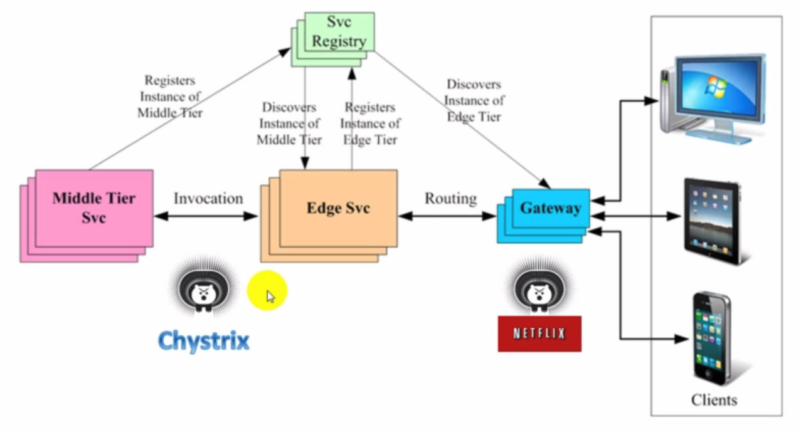

### CTrip Hystrix Dashboard
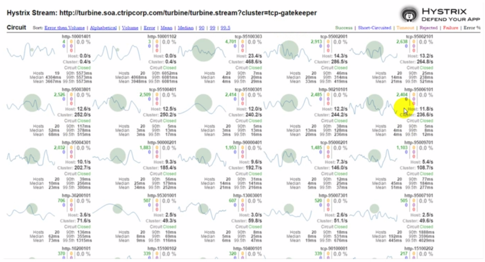


## Hystrix设计原理

### Hystrix工作流程(自适应反馈机)
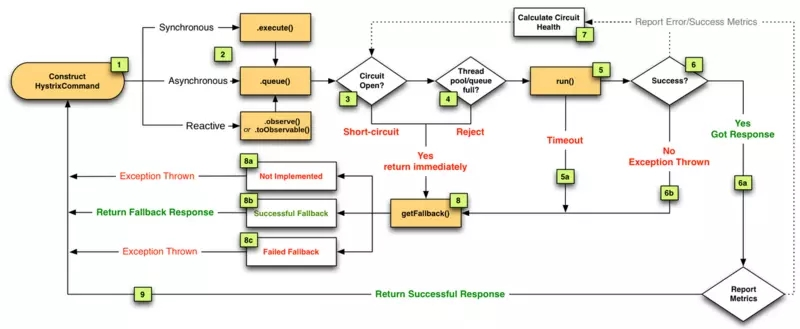

### 断路器内核
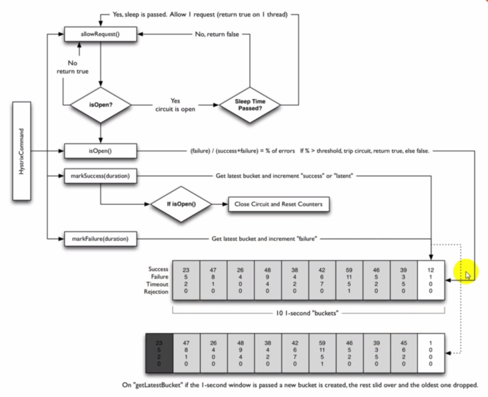


## Hystrix主要概念

### Hystrix Command
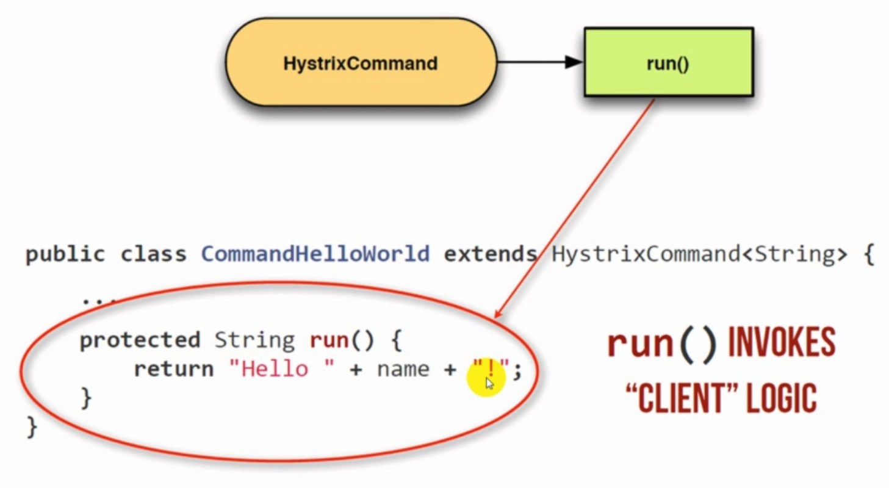

### Fail Fast
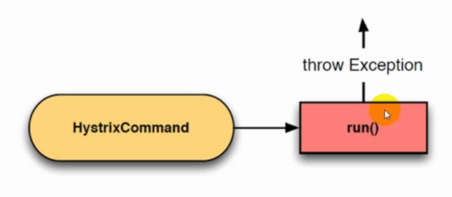

### Fail Silent
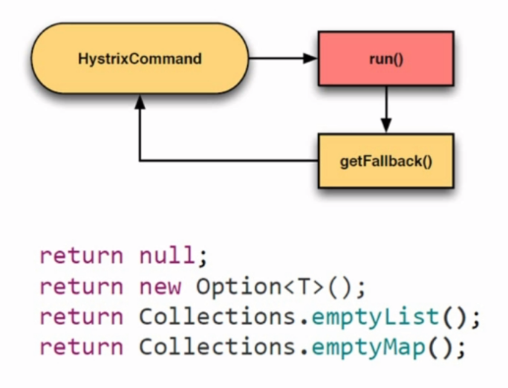

### Static Fallback
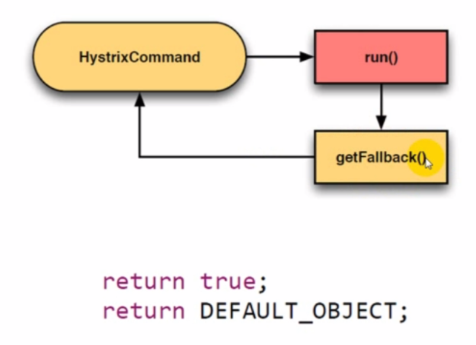

### Failback via Network
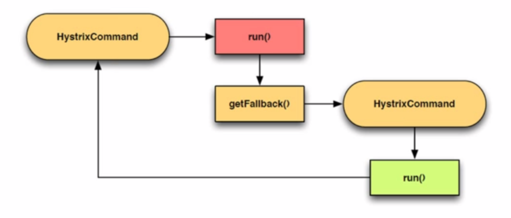

### Primary + Secondary with Fallback
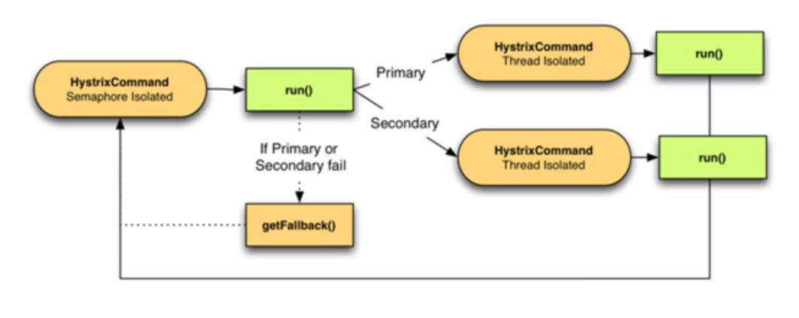

### 请求合并
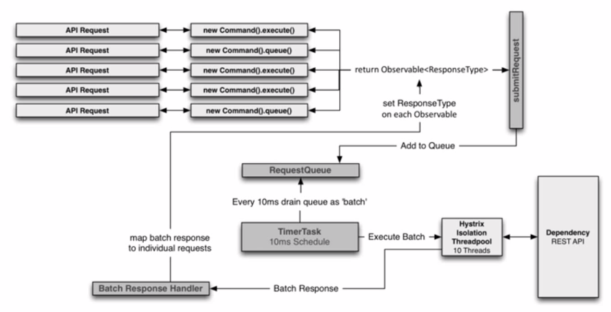

### 请求缓存
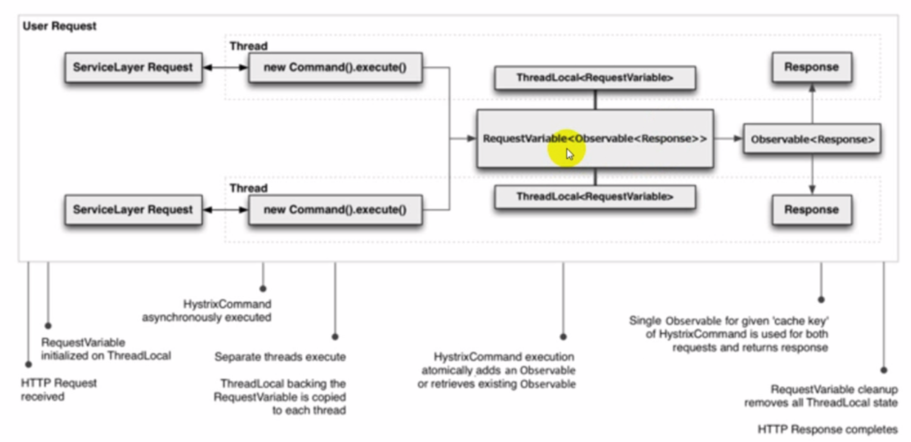


## 信号量vs线程池隔离

### 线程和信号量隔离
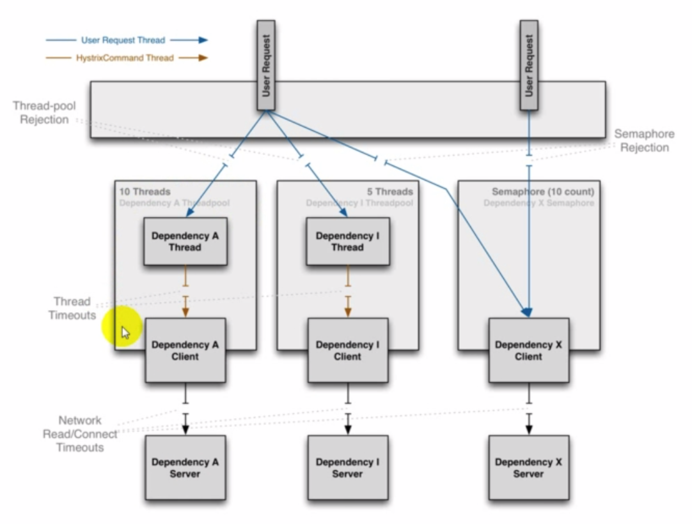

### 线程隔离案例
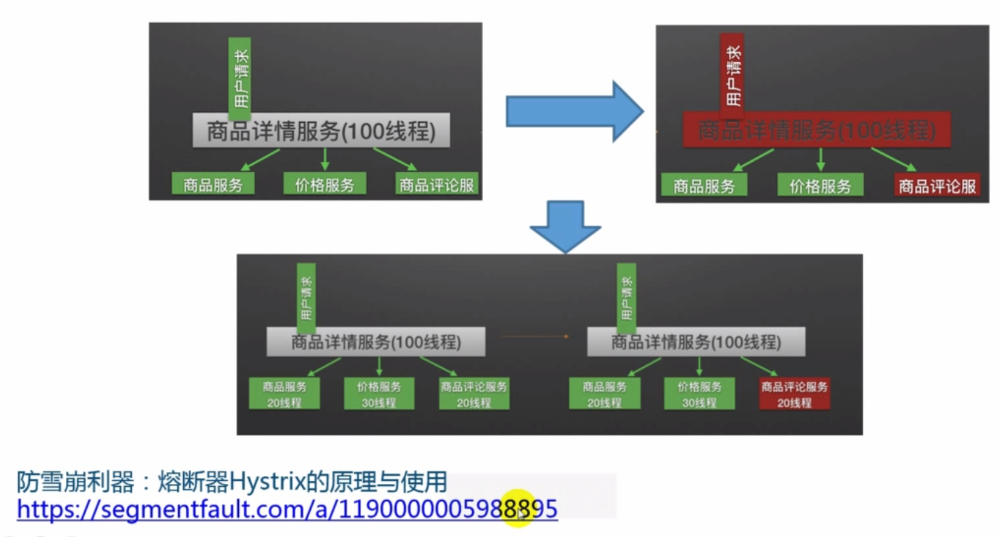

### 线程 vs 信号量隔离
#### 信号量隔离
- 优点  
• 轻量，无额外开销  
- 不足  
• 不支持任务排队和主动超时  
• 不支持异步调用  
- 适用  
• 受信客户  
• 高扇出(网关)  
• 高频高速调用(cache)  

#### 线程池隔离
- 优点  
• 支持排队和超时  
• 支持异步调用  
- 不足  
• 线程调用会产生额外的开销  
- 适用  
• 不受信客户  
• 有限扇出  


## Hystrix主要配置项

### 主要配置项

| 配置项(前缀hystrix.command.*）                      | 含义                                                 |
| --------------------------------------------------- | ---------------------------------------------------- |
| execution.isolation.strategy                        | 线程“THREAD”或信号量“SEMAPHORE“隔离(Default: THREAD) |
| execution.isolation.thread.timeoutlnMilliseconds    | run()方法执行超时时间(Default: 1000)                 |
| execution.isolation.semaphore.maxConcurrentRequests | 信号量隔离最大并发数(Default:10)                     |
| circuitBreaker.errorThresholdPercentage             | 熔断的错误百分比阀值(Default:50)                     |
| circuitBreaker.requestVolumeThreshold               | 断路器生效必须满足的流量阀值(Default:20)             |
| circuitBreaker.sleepWindowlnMilliseconds            | 熔断后重置断路器的时间间隔(Default:5000)             |
| circuitBreaker.forceOpen                            | 设true表示强制熔断器进入打开状态(Default: false)     |
| circuitBreaker.forceClosed                          | 设true表示强制熔断器进入关闭状态(Default: false)     |

| 配置项（前缀hystrix.threadpool.*.） | 含义                                                         |
| ----------------------------------- | ------------------------------------------------------------ |
| coreSize                            | 使用线程池时的最大并发请求(Default: 10)                      |
| maxQueueSize                        | 最大LinkedBlockingQueue大小，-1表示用SynchronousQueue(Default:-1) |
| default.queueSizeRejectionThreshold | 队列大小阀值，超过则拒绝(Default:5)                          |

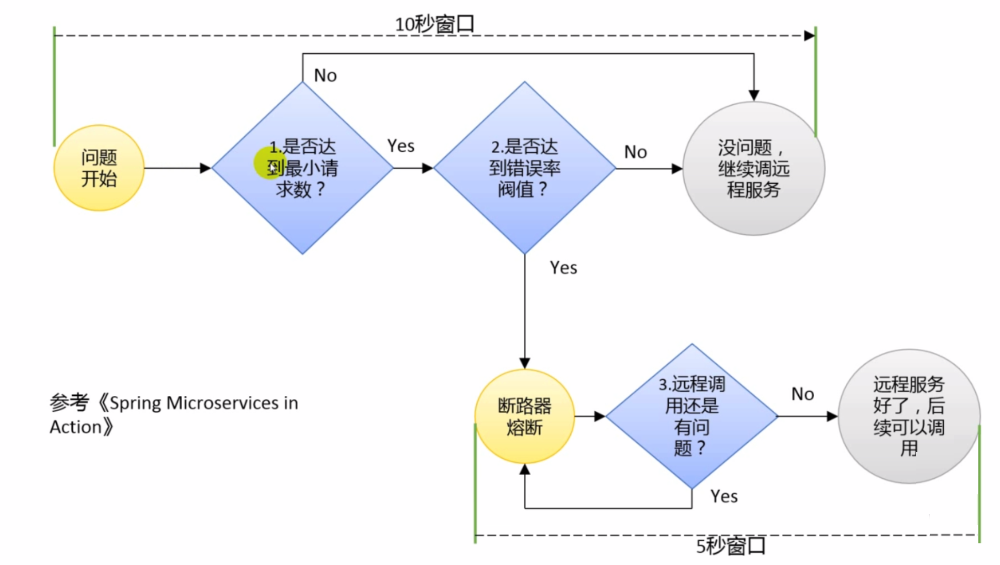


## Hystrix基础实验(Lab01)

1. 同步调用testSynchronous
2. 同步安静失败testSynchronousFailSilently
3. 同步快速失败testSynchronousFailFast
4. 异步调用testAsynchronous
5. 响应式调用testObservable
6. 缓存调用testWithCacheHist

[https://github.com/spring2go/hystrix_lab/tree/master/lab01](https://github.com/spring2go/hystrix_lab/tree/master/lab01)


## Hystrix模拟案例分析(Code Review)

### 模拟交易


## Hystrix + Dashboard(Lab01)

### Hystrix Dashboard

### 滚动式统计
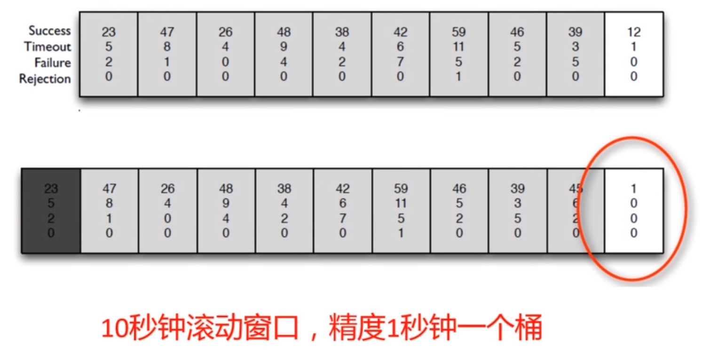

### 熔断


## Hystrix + Dashboard(Lab02)

[https://github.com/spring2go/hystrix_lab/tree/master/lab02](https://github.com/spring2go/hystrix_lab/tree/master/lab02)


## 网关集成Hystrix(Code Review)

### 网关和Hystrix参考部署
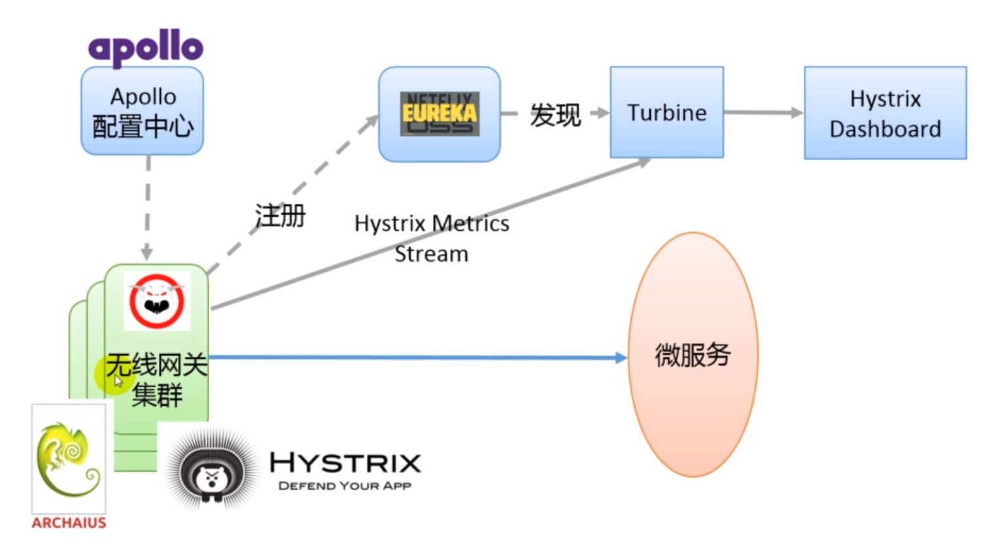

```java
RequestContext ctx = RequestContext.getCurrentContext();

String groupName = ctx.getRouteGroup();
String routeName = ctx.getRouteName();

if (groupName == null) groupName = Constants.DEFAULT_GROUP;
if (routeName == null) routeName = Constants.DEFAULT_NAME;

......

HttpResponse response = forward(httpclient, requestConfig, verb, url, headers, requestEntity, contentLength, groupName, routeName);
```

```java
HttpResponse forward(HttpClient httpclient, RequestConfig requestConfig, String verb, String url, Header[] headers, InputStream requestEntity, int contentLength, String groupName, String routName) {
	......		
    if("THREAD".equalsIgnoreCase(isolationStrategy)){
		return new ZuulRequestCommandForThreadIsolation(httpclient, httpUriRequest, groupName, routName).execute();
	}else{
		return new ZuulRequestCommandForSemaphoreIsolation(httpclient, httpUriRequest, groupName, routName).execute();
	}
}
```

```java
public class ZuulRequestCommandForThreadIsolation extends HystrixCommand<HttpResponse> {

    HttpClient httpclient;
    HttpUriRequest httpUriRequest;
    HttpContext httpContext;

    public ZuulRequestCommandForThreadIsolation(HttpClient httpclient, HttpUriRequest httpUriRequest, String commandGroup, String commandKey) {
        this(httpclient, httpUriRequest, null,commandGroup, commandKey);
    }
    public ZuulRequestCommandForThreadIsolation(HttpClient httpclient, HttpUriRequest httpUriRequest, HttpContext httpContext, String commandGroup, String commandKey) {
        this(httpclient, httpUriRequest, httpContext,commandGroup, commandKey, ZuulCommandHelper.getThreadPoolKey(commandGroup,commandKey));
    }

    public ZuulRequestCommandForThreadIsolation(HttpClient httpclient, HttpUriRequest httpUriRequest, HttpContext httpContext, String commandGroup, String commandKey, String threadPoolKey) {

        super(Setter
                .withGroupKey(HystrixCommandGroupKey.Factory.asKey(commandGroup))
                .andCommandKey(HystrixCommandKey.Factory.asKey(commandKey))
                .andThreadPoolKey(HystrixThreadPoolKey.Factory.asKey(threadPoolKey))
                .andCommandPropertiesDefaults(
                        HystrixCommandProperties.Setter()
                                .withExecutionIsolationStrategy(HystrixCommandProperties.ExecutionIsolationStrategy.THREAD)
                )
        );
        this.httpclient = httpclient;
        this.httpUriRequest = httpUriRequest;
        this.httpContext = httpContext;
    }

    @Override
    protected HttpResponse run() throws Exception {
        try {
            return forward();
        } catch (IOException e) {
            throw e;
        }
    }

    HttpResponse forward() throws IOException {
        return httpclient.execute(httpUriRequest, httpContext);
    }
}
```

```java
import com.netflix.config.DynamicPropertyFactory;

public class ZuulCommandHelper {
    public static int getSemaphoreMaxConcurrent(String commandGroup, String commandKey) {
        int maxConcurrent = DynamicPropertyFactory.getInstance().getIntProperty(commandKey + ".semaphore.max", 0).get();
        if (maxConcurrent == 0) {
            maxConcurrent = DynamicPropertyFactory.getInstance().getIntProperty(commandGroup + ".semaphore.max", 0).get();
        }
        if (maxConcurrent == 0) {
            maxConcurrent = DynamicPropertyFactory.getInstance().getIntProperty("zuul.semaphore.max.global", 100).get();
        }
        return maxConcurrent;
    }

    public static String getThreadPoolKey(String commandGroup, String commandKey) {
        String poolKey = DynamicPropertyFactory.getInstance().getStringProperty(commandKey + ".thread-pool.key", null).get();
        if (poolKey == null) {
            poolKey = DynamicPropertyFactory.getInstance().getStringProperty(commandGroup + ".thread-pool.key", commandGroup).get();
        }
        return poolKey;
    }

    public static int getThreadTimeout(String commandGroup, String commandKey) {
        int timeout = DynamicPropertyFactory.getInstance().getIntProperty(commandKey + ".thread.timeout", 0).get();
        if (timeout == 0) {
            timeout = DynamicPropertyFactory.getInstance().getIntProperty(commandGroup + ".thread.timeout", 0).get();
        }
        if (timeout == 0) {
            timeout = DynamicPropertyFactory.getInstance().getIntProperty("zuul.thread.timeout.global", 1500).get();
        }
        return timeout;
    }

    public static boolean getCircuitBreakerEnabled(String commandGroup, String commandKey) {
        String bool = DynamicPropertyFactory.getInstance().getStringProperty(commandKey + ".circuit-breaker.enabled", null).get();
        if (bool == null) {
            bool = DynamicPropertyFactory.getInstance().getStringProperty(commandGroup + ".circuit-breaker.enabled", null).get();
        }
        if (bool == null) {
            bool = DynamicPropertyFactory.getInstance().getStringProperty("zuul.circuit-breaker.enabled.global", "true").get();
        }
        return bool.toString().equalsIgnoreCase("true");
    }

    public static boolean getCircuitBreakerForceOpen(String commandGroup, String commandKey) {
        String bool = DynamicPropertyFactory.getInstance().getStringProperty(commandKey + ".circuit-breaker.force-open", null).get();
        if (bool == null) {
            bool = DynamicPropertyFactory.getInstance().getStringProperty(commandGroup + ".circuit-breaker.force-open", null).get();
        }
        if (bool == null) {
            bool = DynamicPropertyFactory.getInstance().getStringProperty("zuul.circuit-breaker.force-open.global", "false").get();
        }
        return bool.toString().equalsIgnoreCase("true");
    }

    public static boolean getCircuitBreakerForceClosed(String commandGroup, String commandKey) {
        String bool = DynamicPropertyFactory.getInstance().getStringProperty(commandKey + ".circuit-breaker.force-closed", null).get();
        if (bool == null) {
            bool = DynamicPropertyFactory.getInstance().getStringProperty(commandGroup + ".circuit-breaker.force-closed", null).get();
        }
        if (bool == null) {
            bool = DynamicPropertyFactory.getInstance().getStringProperty("zuul.circuit-breaker.force-closed.global", "false").get();
        }
        return bool.toString().equalsIgnoreCase("true");
    }

    public static int getCircuitBreakerRequestThreshold(String commandGroup, String commandKey) {
        int i = DynamicPropertyFactory.getInstance().getIntProperty(commandKey + ".circuit-breaker.request-threshold", 0).get();
        if (i == 0) {
            i = DynamicPropertyFactory.getInstance().getIntProperty(commandGroup + ".circuit-breaker.request-threshold", 0).get();
        }
        if (i == 0) {
            i = DynamicPropertyFactory.getInstance().getIntProperty("zuul.circuit-breaker.request-threshold.global", 10).get();
        }
        return i;
    }

    public static int getCircuitBreakerErrorThreshold(String commandGroup, String commandKey) {
        int i = DynamicPropertyFactory.getInstance().getIntProperty(commandKey + ".circuit-breaker.error-percentage", 0).get();
        if (i == 0) {
            i = DynamicPropertyFactory.getInstance().getIntProperty(commandGroup + ".circuit-breaker.error-percentage", 0).get();
        }
        if (i == 0) {
            i = DynamicPropertyFactory.getInstance().getIntProperty("zuul.circuit-breaker.error-percentage.global", 30).get();
        }
        return i;
    }

    public static int getCircuitBreakerSleep(String commandGroup, String commandKey) {
        int i = DynamicPropertyFactory.getInstance().getIntProperty(commandKey + ".circuit-breaker.sleep", 0).get();
        if (i == 0) {
            i = DynamicPropertyFactory.getInstance().getIntProperty(commandGroup + ".circuit-breaker.sleep", 0).get();
        }
        if (i == 0) {
            i = DynamicPropertyFactory.getInstance().getIntProperty("zuul.circuit-breaker.sleep.global", 10000).get();
        }
        return i;
    }

    public static int getThreadPoolSize(String threadPoolKey) {
        int i = DynamicPropertyFactory.getInstance().getIntProperty(threadPoolKey + ".hystrix.thread-pool.size", 0).get();
        if (i == 0) {
            i = DynamicPropertyFactory.getInstance().getIntProperty("zuul.hystrix.thread-pool.size.global", 10).get();
        }
        return i;
    }
    
    public static int getRibbonMaxHttpConnectionsPerHost(String serviceName){
        int i = DynamicPropertyFactory.getInstance().getIntProperty("ribbon."+serviceName + ".hystrix.maxconnections.perhost", 0).get();
        if (i == 0) {
            i = DynamicPropertyFactory.getInstance().getIntProperty("ribbon.hystrix.maxconnections.perhost.global", 500).get();
        }
        return i;
    }
    
    public static int  getRibbonMaxTotalHttpConnections(String serviceName){
        int i = DynamicPropertyFactory.getInstance().getIntProperty("ribbon."+serviceName + ".hystrix.maxconnections", 0).get();
        if (i == 0) {
            i = DynamicPropertyFactory.getInstance().getIntProperty("ribbon.hystrix.maxconnections.global", 2000).get();
        }
        return i;
    }
    
    public static int  getRibbonMaxAutoRetries(String serviceName){
        int i = DynamicPropertyFactory.getInstance().getIntProperty("ribbon."+serviceName + ".hystrix.maxautoretries", 0).get();
        if (i == 0) {
            i = DynamicPropertyFactory.getInstance().getIntProperty("ribbon.global.hystrix.maxautoretries.global", 1).get();
        }
        return i;
    }
    
    public static int getRibbonMaxAutoRetriesNextServer(String serviceName){
        int i = DynamicPropertyFactory.getInstance().getIntProperty(serviceName + ".ribbon.hystrix.maxautoretries.nextserver", 0).get();
        if (i == 0) {
            i = DynamicPropertyFactory.getInstance().getIntProperty("ribbon.hystrix.maxautoretries.nextserver.global", 1).get();
        }
        return i;
    }
    
    public static String getRibbonLoadBalanceRule(String groupName, String routeName) {
        String rule = DynamicPropertyFactory.getInstance().getStringProperty("ribbon."+routeName + ".lb.rule", null).get();
        if (rule == null) {
        	rule = DynamicPropertyFactory.getInstance().getStringProperty("ribbon."+groupName + ".lb.rule", null).get();
        }
        if (rule == null) {
        	rule = DynamicPropertyFactory.getInstance().getStringProperty("ribbon.lb.rule.global", "com.netflix.loadbalancer.RetryRule").get();
        }
        return rule;
    }
    
    public static int getRibbonConnectTimeout(String groupName, String routeName) {
		int connectTimeout = DynamicPropertyFactory.getInstance().getIntProperty("ribbon."+routeName + ".connect.timeout", 0)
				.get();
		if (connectTimeout == 0) {
			connectTimeout = DynamicPropertyFactory.getInstance().getIntProperty("ribbon."+groupName + ".connect.timeout", 0)
					.get();
		}
		if (connectTimeout == 0) {
			connectTimeout = DynamicPropertyFactory.getInstance().getIntProperty("zuul.connect.timeout.global", 20000)
					.get();
		}
		return connectTimeout;
    }
    
    public static int  getRibbonReadTimeout(String groupName, String routeName) {
		int socketTimeout = DynamicPropertyFactory.getInstance().getIntProperty("ribbbon."+routeName + ".socket.timeout", 0).get();
		if (socketTimeout == 0) {
			socketTimeout = DynamicPropertyFactory.getInstance().getIntProperty("ribbbon."+groupName + ".socket.timeout", 0).get();
		}
		if (socketTimeout == 0) {
			socketTimeout = DynamicPropertyFactory.getInstance().getIntProperty("zuul.socket.timeout.global", 10000)
					.get();
		}
		return socketTimeout;
    }
    
    public static boolean getRibbonRequestSpecificRetryOn(String groupName, String routeName) {
		boolean nextTry = DynamicPropertyFactory.getInstance().getBooleanProperty("ribbbon."+routeName + ".next.try", false).get();
		if (!nextTry) {
			nextTry = DynamicPropertyFactory.getInstance().getBooleanProperty("ribbbon."+groupName + ".next.try", false).get();
		}
		if (!nextTry) {
			nextTry = DynamicPropertyFactory.getInstance().getBooleanProperty("zuul.socket.next.try.global", true).get();
		}
		return nextTry;
    }
    
    public static boolean getRibbonOkToRetryOnAllOperations(String groupName, String routeName) {
    	boolean sameTry = DynamicPropertyFactory.getInstance().getBooleanProperty("ribbbon."+routeName + ".same.try", false).get();
		if (!sameTry) {
			sameTry = DynamicPropertyFactory.getInstance().getBooleanProperty("ribbbon."+groupName + ".same.try", false).get();
		}
		if (!sameTry) {
			sameTry = DynamicPropertyFactory.getInstance().getBooleanProperty("zuul.socket.same.try.global", true).get();
		}
		return sameTry;
    }
}
```


## Spring Cloud Hystrix实验(Lab04)

[https://github.com/spring2go/hystrix_lab/tree/master/lab03](https://github.com/spring2go/hystrix_lab/tree/master/lab03)


## Netflix Turbin简介

### 对接Eureka
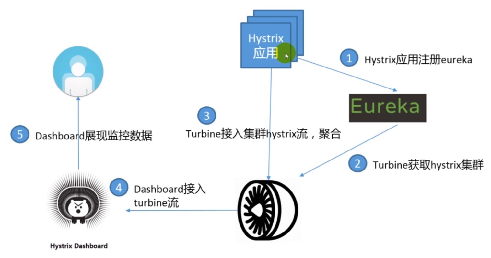


## Hystrix生产最佳实践

### 最佳实践
- 网关集中埋点，覆盖大部分场景  
- 尽量框架集中埋点，客户端为主  
- 配置对接Apollo，根据实际使用调整阀值  
- 信号量vs线程池场景  
• 信号量：网关，缓存  
• 线程池场景：服务问调用客户端，数据库访问，第三方访问  
-  线程池大小经验值  
• 30 rps x 0.2 sec = 6 + breathing room = 10 threads  
• Thread-pool Queue size : 5 ~ 10  
- 部署  
• Hystrix Dashboard大盘（无线/H5/第三方网关）  
• 共享Hystrix Dashboard/Turbine服务器  
• 熔断告警  
- Spring Cloud Hystrix标注  


参考：  
[https://github.com/spring2go/s2g-zuul](https://github.com/spring2go/s2g-zuul)  
