### 定义与类型
定义:定义一个创建对象的接口，但让实现这个接口的类来决定实例化哪个类，工厂方法让类的实例化推迟到子类中进行  
类型:创建型
### 适用场景
- 创建对象需要大量重复的代码
- 客户端(应用层)不依赖于产品类实例如何被创建、实现等细节
- 一个类通过其子类来指定创建哪个对象

### 优点
- 用户只需要关心所需要产品对应的工厂，无须关心创建细节
- 加入新产品符合开闭原则，提高可扩展性

### 缺点
- 类的个数容易过多，增加复杂度
- 增加了系统的抽象性和理解难度

### Coding
```java
public abstract class Video {
    public abstract void produce();
}
```
```java
public abstract class VideoFactory {
    public abstract Video getVideo();
}
```
```java
public class JavaVideo extends Video {
    @Override
    public void produce() {
        System.out.println("录制Java课程视频");
    }
}
```
```java
public class JavaVideoFactory extends VideoFactory {
    @Override
    public Video getVideo() {
        return new JavaVideo();
    }
}
```
```java
public class PythonVideo extends Video {
    @Override
    public void produce() {
        System.out.println("录制Python课程视频");
    }
}
```
```java
public class PythonVideoFactory extends VideoFactory {
    @Override
    public Video getVideo() {
        return new PythonVideo();
    }
}
```
```java
public class FEVideo extends Video{
    @Override
    public void produce() {
        System.out.println("录制FE课程视频");
    }
}
```
```java
public class FEVideoFactory extends VideoFactory{
    @Override
    public Video getVideo() {
        return new FEVideo();
    }
}
```
```java
public class Test {
    public static void main(String[] args) {
        VideoFactory videoFactory = new PythonVideoFactory();
        VideoFactory videoFactory2 = new JavaVideoFactory();
        VideoFactory videoFactory3 = new FEVideoFactory();
        Video video = videoFactory.getVideo();
        video.produce();
    }
}
```
### UML
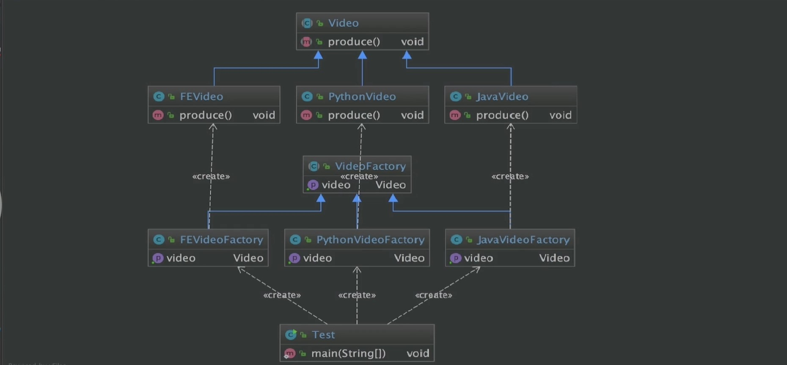

### 源码解析
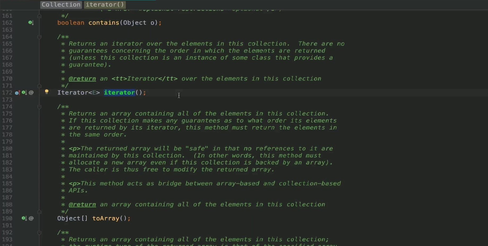
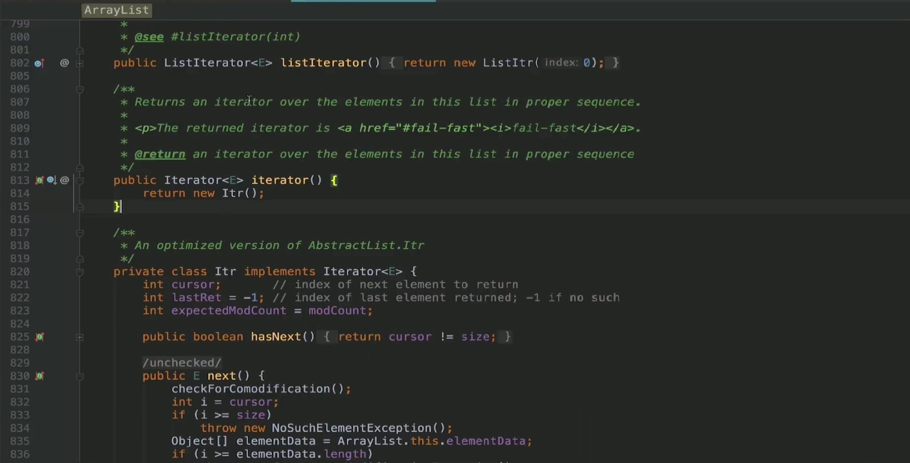
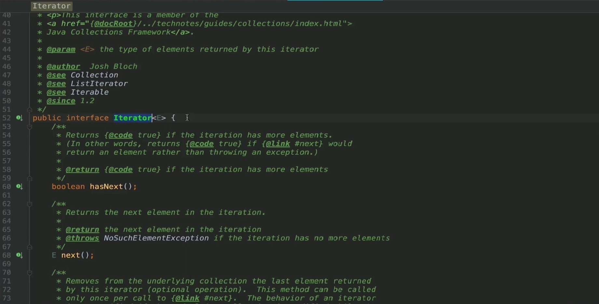
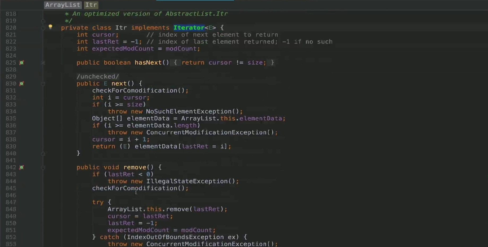
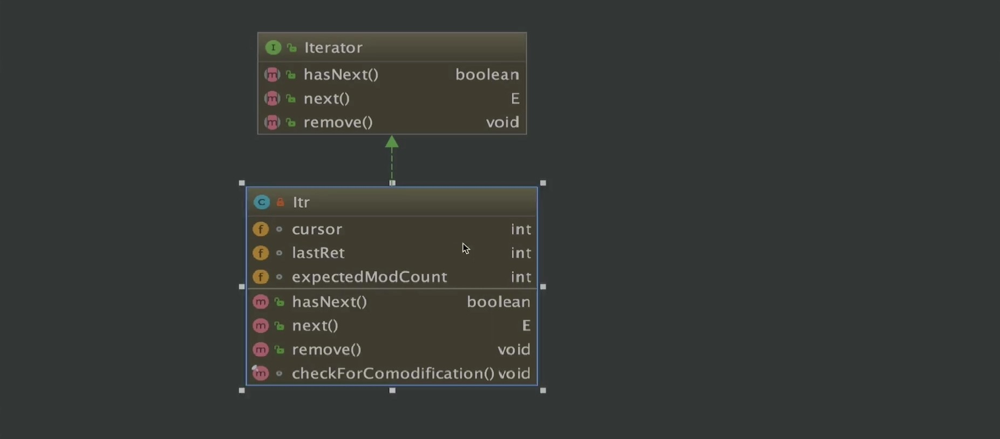
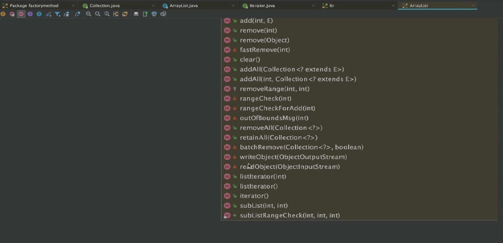
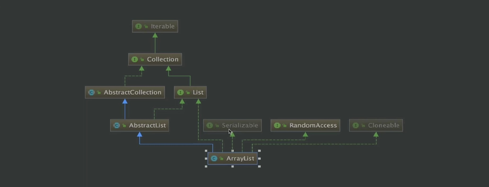
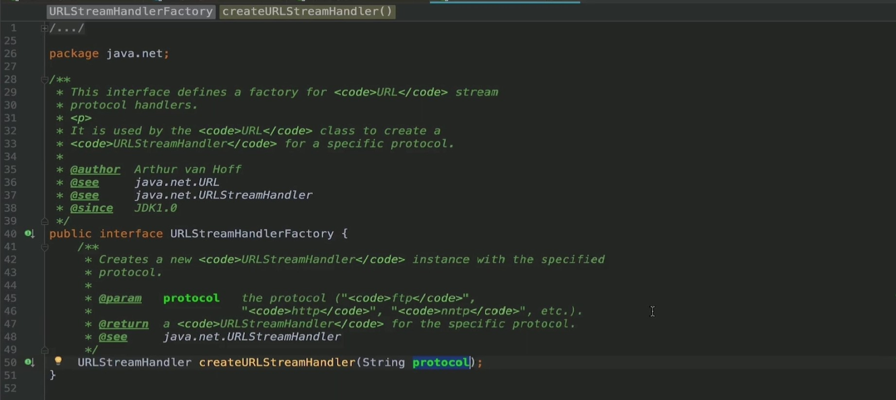
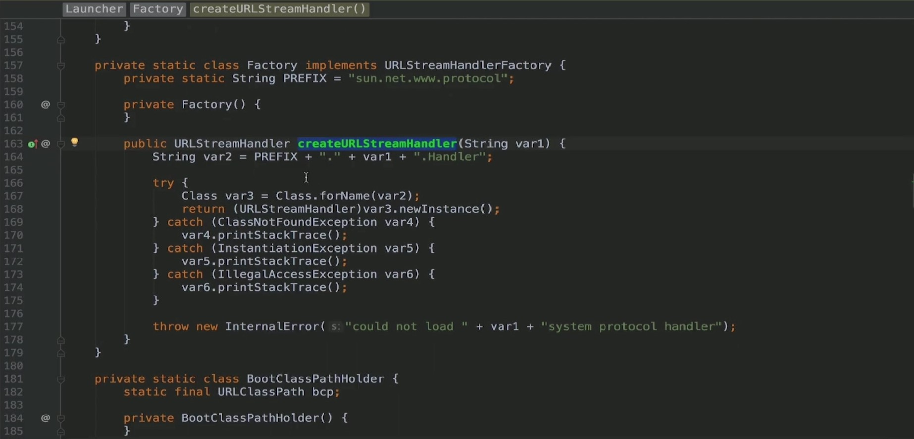
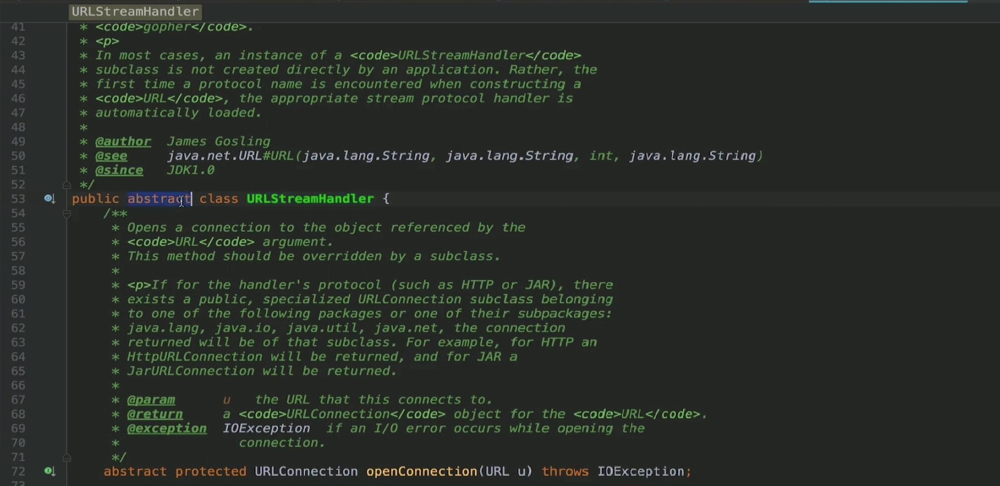
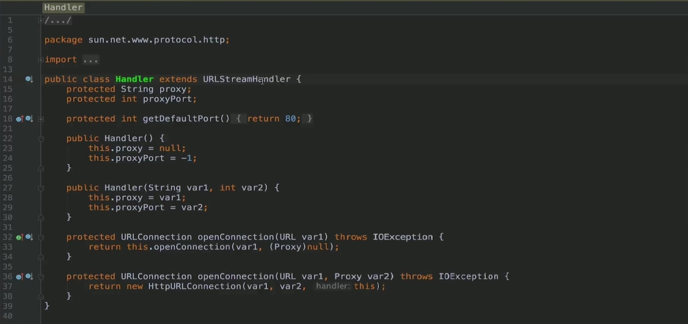
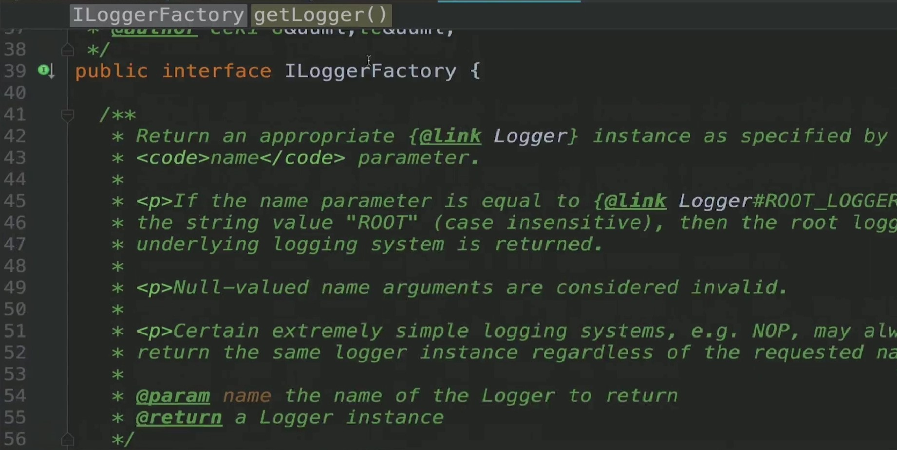
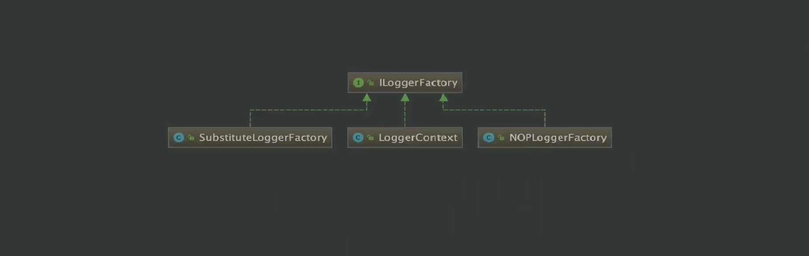