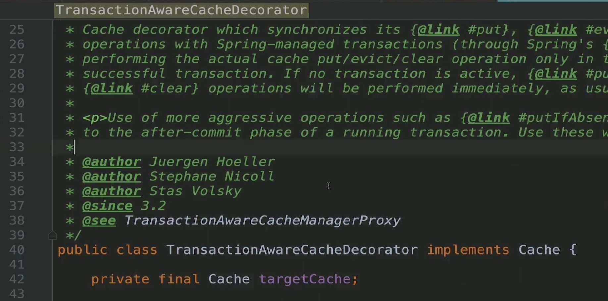

### 定义与类型
定义:在不改变原有对象的基础上，将功能附加到对象上，提供了比继承更有弹性的替代方案(扩展原有对象功能)  
类型:结构型
### 适用场景
- 扩展一个类的功能或给一个类添加附加职责  
- 动态的给一个对象添加功能，这些功能可以再动态的撤销  

### 优点
- 继承的有力补充，比继承灵活，不改变原有对象的情况下给一个对象扩展功能  
- 通过使用不同装饰类以及这些装饰类的排列组合，可以实现不同效果  
- 符合开闭原则  

### 缺点
- 会出现更多的代码，更多的类，增加程序复杂性  
- 动态装饰时，多层装饰时会更复杂   

### 扩装饰者-相关设计模式
- 装饰者模式和代理模式  
- 装饰者模式和适配器模式  

### Coding
v1:  
```java
public class Battercake {
    protected String getDesc(){
        return "煎饼";
    }
    protected int cost(){
        return 8;
    }
}
```
```java
public class BattercakeWithEgg extends Battercake {
    @Override
    public String getDesc() {
        return super.getDesc()+" 加一个鸡蛋";
    }

    @Override
    public int cost() {
        return super.cost()+1;
    }
}
```
```java
public class BattercakeWithEggSausage extends BattercakeWithEgg {
    @Override
    public String getDesc() {
        return super.getDesc()+ " 加一根香肠";
    }

    @Override
    public int cost() {
        return super.cost()+2;
    }
}
```
```java
public class Test {
    public static void main(String[] args) {
        Battercake battercake = new Battercake();
        System.out.println(battercake.getDesc()+" 销售价格:"+battercake.cost());

        Battercake battercakeWithEgg = new BattercakeWithEgg();
        System.out.println(battercakeWithEgg.getDesc()+" 销售价格:"+battercakeWithEgg.cost());


        Battercake battercakeWithEggSausage = new BattercakeWithEggSausage();
        System.out.println(battercakeWithEggSausage.getDesc()+" 销售价格:"+battercakeWithEggSausage.cost());
    }
}
```
v2:  
```java
public abstract class ABattercake {
    protected abstract String getDesc();
    protected abstract int cost();

}
```
```java
public abstract class AbstractDecorator extends ABattercake {
    private ABattercake aBattercake;

    public AbstractDecorator(ABattercake aBattercake) {
        this.aBattercake = aBattercake;
    }

    protected abstract void doSomething();

    @Override
    protected String getDesc() {
        return this.aBattercake.getDesc();
    }

    @Override
    protected int cost() {
        return this.aBattercake.cost();
    }
}
```
```java
public class EggDecorator extends AbstractDecorator {
    public EggDecorator(ABattercake aBattercake) {
        super(aBattercake);
    }

    @Override
    protected void doSomething() {

    }

    @Override
    protected String getDesc() {
        return super.getDesc()+" 加一个鸡蛋";
    }

    @Override
    protected int cost() {
        return super.cost()+1;
    }
}
```
```java
public class SausageDecorator extends AbstractDecorator{
    public SausageDecorator(ABattercake aBattercake) {
        super(aBattercake);
    }

    @Override
    protected void doSomething() {

    }

    @Override
    protected String getDesc() {
        return super.getDesc()+" 加一根香肠";
    }

    @Override
    protected int cost() {
        return super.cost()+2;
    }
}
```
```java
public class Battercake extends ABattercake {
    @Override
    protected String getDesc() {
        return "煎饼";
    }

    @Override
    protected int cost() {
        return 8;
    }
}
```
```java
public class Test {
    public static void main(String[] args) {
        ABattercake aBattercake;
        aBattercake = new Battercake();
        aBattercake = new EggDecorator(aBattercake);
        aBattercake = new EggDecorator(aBattercake);
        aBattercake = new SausageDecorator(aBattercake);

        System.out.println(aBattercake.getDesc()+" 销售价格:"+aBattercake.cost());
    }
}
```

### UML


### 源码解析





