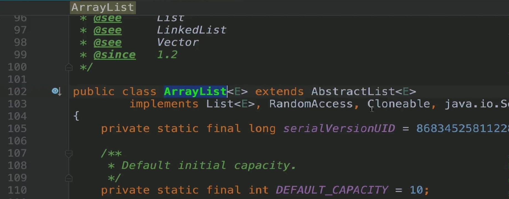
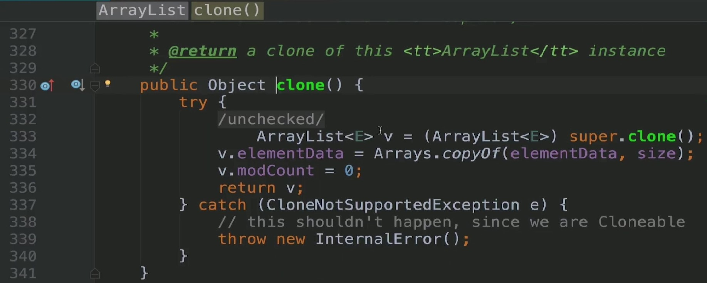
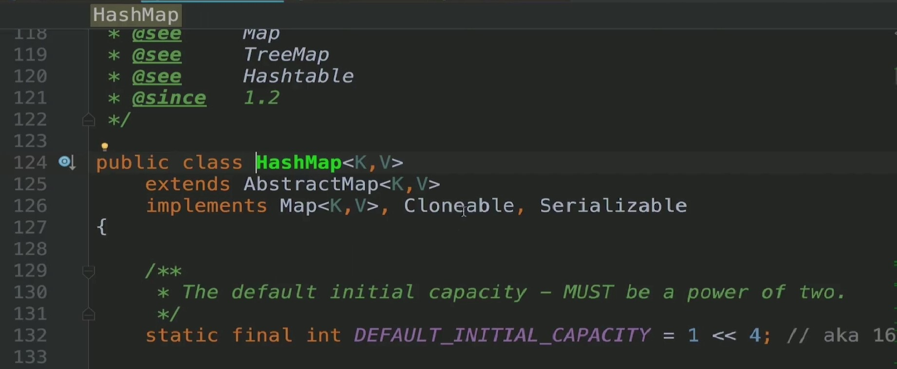
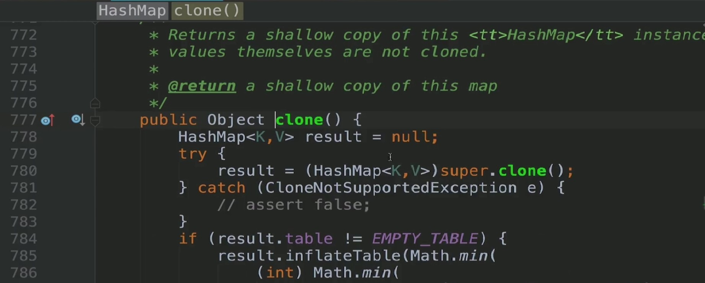
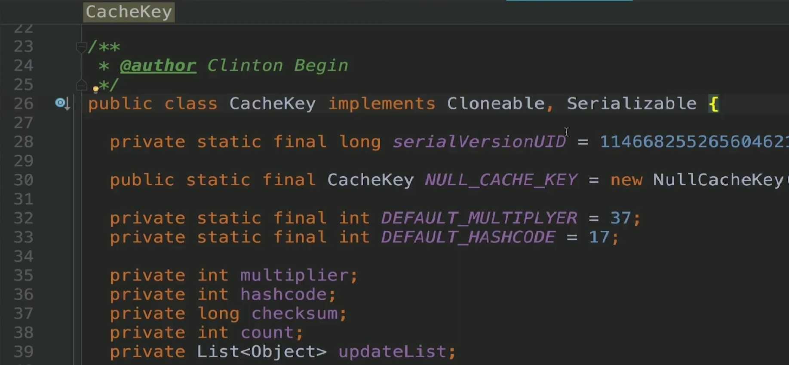
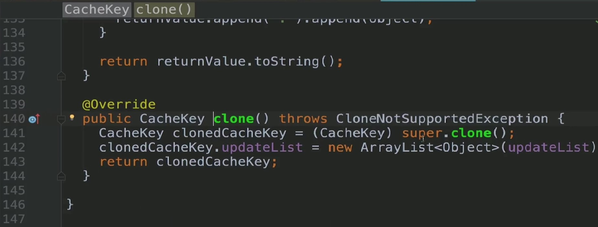
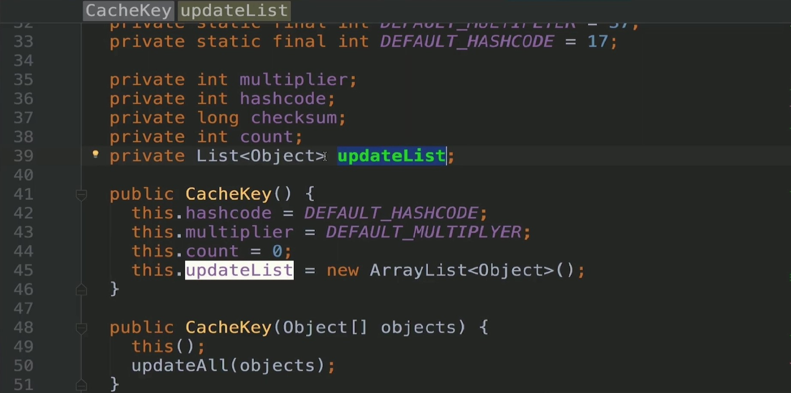

### 定义与类型
定义:指原型实例指定创建对象的种类，并且通过拷贝这些原型创建新的对象，不需要知道任何创建的细节，不调用构造函数  
类型:创建型
### 适用场景
- 类初始化消耗较多资源
- new产生的一个对象需要非常繁琐的过程(数据准备、访问权限等)  
- 构造函数比较复杂  
- 循环体中生产大量对象时

### 优点
- 原型模式性能比直接new一个对象性能高  
- 简化创建过程  

### 缺点
- 必须配备克隆方法  
- 对克隆复杂对象或对克隆出的对象进行复杂改造时，容易引入风险  
- 深拷贝、浅拷贝要运用得当  

### 扩展
- 深拷贝  
- 浅拷贝  

### Coding
```java
@Data
@ToString
public class Mail implements Cloneable{
    private String name;
    private String emailAddress;
    private String content;
    public Mail(){
        System.out.println("Mail Class Constructor");
    }

    @Override
    protected Object clone() throws CloneNotSupportedException {
        System.out.println("clone mail object");
        return super.clone();
    }
}
```
```java
public class MailUtil {
    public static void sendMail(Mail mail){
        String outputContent = "向{0}同学,邮件地址:{1},邮件内容:{2}发送邮件成功";
        System.out.println(MessageFormat.format(outputContent,mail.getName(),mail.getEmailAddress(),mail.getContent()));
    }
    public static void saveOriginMailRecord(Mail mail){
        System.out.println("存储originMail记录,originMail:"+mail.getContent());
    }
}
```
```java
public class Test {
    public static void main(String[] args) throws CloneNotSupportedException {
        Mail mail = new Mail();
        mail.setContent("初始化模板");
        System.out.println("初始化mail:"+mail);
        for(int i = 0;i < 10;i++){
            Mail mailTemp = (Mail) mail.clone();
            mailTemp.setName("姓名"+i);
            mailTemp.setEmailAddress("姓名"+i+"@imooc.com");
            mailTemp.setContent("恭喜您，此次慕课网活动中奖了");
            MailUtil.sendMail(mailTemp);
            System.out.println("克隆的mailTemp:"+mailTemp);
        }
        MailUtil.saveOriginMailRecord(mail);
    }
}
```
```java
public abstract class A implements Cloneable{
    @Override
    protected Object clone() throws CloneNotSupportedException {
        return super.clone();
    }
}
```
```java
public class B extends A {
    public static void main(String[] args) throws CloneNotSupportedException {
        B b = new B();
        b.clone();
    }
}
```
```java
@Data
@ToString
public class Pig implements Cloneable{
    private String name;
    private Date birthday;

    public Pig(String name, Date birthday) {
        this.name = name;
        this.birthday = birthday;
    }

    @Override
    protected Object clone() throws CloneNotSupportedException {
        Pig pig = (Pig)super.clone();

        //深克隆
        pig.birthday = (Date) pig.birthday.clone();
        return pig;
    }
}
```
```java
public class Test {
    public static void main(String[] args) throws CloneNotSupportedException, NoSuchMethodException, InvocationTargetException, IllegalAccessException {
        Date birthday = new Date(0L);
        Pig pig1 = new Pig("佩奇",birthday);
        Pig pig2 = (Pig) pig1.clone();
        System.out.println(pig1);
        System.out.println(pig2);

        pig1.getBirthday().setTime(666666666666L);

        System.out.println(pig1);
        System.out.println(pig2);

//        HungrySingleton hungrySingleton = HungrySingleton.getInstance();
//        Method method = hungrySingleton.getClass().getDeclaredMethod("clone");
//        method.setAccessible(true);
//        HungrySingleton cloneHungrySingleton = (HungrySingleton) method.invoke(hungrySingleton);
//        System.out.println(hungrySingleton);
//        System.out.println(cloneHungrySingleton);
    }
}
```

### 源码解析






