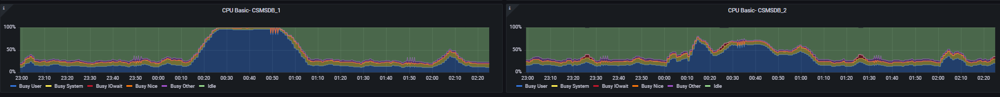
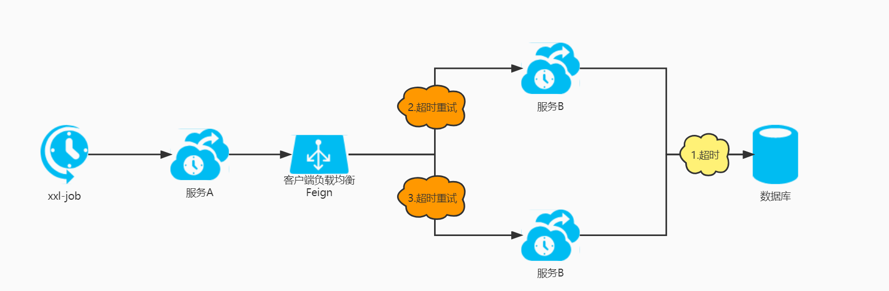

## 场景一

### 问题

CPU使用率接近100%持续半小时  


### 监控
某个SQL持续执行了7次并且总共持续了20-40mins  

### 排查
1. 通过查询后台服务日志发现，该SQL的确执行了多次，并且报了`java.sql.SQLRecoverableException: IO Error: Socket read timed out`，SQL对应的接口每次请求完成时间是3分钟。  
初步怀疑是因为SQL执行太久，导致超时。通过检查apollo配置，发现数据库的连接读超时刚好设置为3分钟`spring.datasource.hikari.data-source-properties.oracle.jdbc.ReadTimeout=180000`。
2. 检查业务发现这个接口是查询某种业务月度报表数据，调用链路为xxl-job--->微服务A--->微服务B--->数据库，该SQL是微服务B中提供报表数据所执行的SQL。
初步怀疑SQL多次执行是因为存在for循环或xxl-job的失败重试及超时导致，但是检查确认不存在for循环、xxl-job未配置任何重试策略并且xxl-job对执行时间是无限制的。通过查看SQL对应接口的请求日志发现，该接口被请求了多次，再次怀疑是因为微服务调用组件feign的超时重试机制导致。通过检查apollo发现确实配置了feign的超时重试。
```properties
#ribbon路由策略
ribbon.eureka.enabled = true
ribbon.ReadTimeout = 180000
ribbon.ConnectTimeout = 1000
#同一实例最大重试次数，不包括首次调用
ribbon.MaxAutoRetries = 1
#重试其他实例的最大重试次数，不包括首次所选的server
ribbon.MaxAutoRetriesNextServer = 2
#是否所有操作都进行重试，
ribbon.OkToRetryOnAllOperations = true
hystrix.command.default.execution.isolation.thread.timeoutInMilliseconds = 12000000
```
### 链路
  
服务B一边调用两次，服务B另一边调了四次

### 总结
- SQL执行需要考虑数据量大时的执行性能
- 对于微服务请求超时及数据库执行超时的合理配置

参考：  
[https://www.cnblogs.com/zhangjianbin/p/7228628.html](https://www.cnblogs.com/zhangjianbin/p/7228628.html)  
[https://docs.oracle.com/cd/E57185_01/ESTUG/apbs02s23.html](https://docs.oracle.com/cd/E57185_01/ESTUG/apbs02s23.html)  
