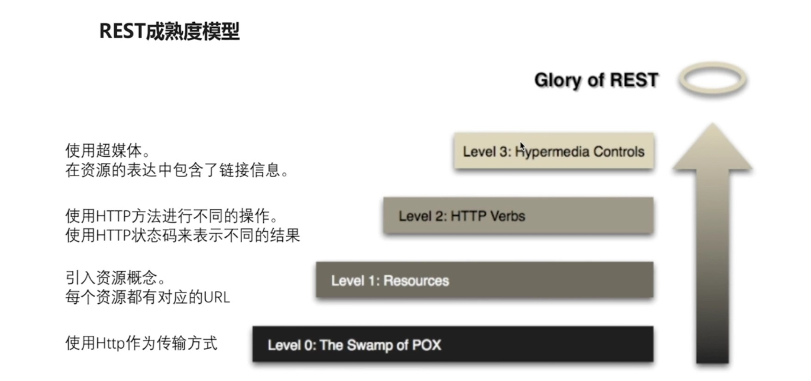
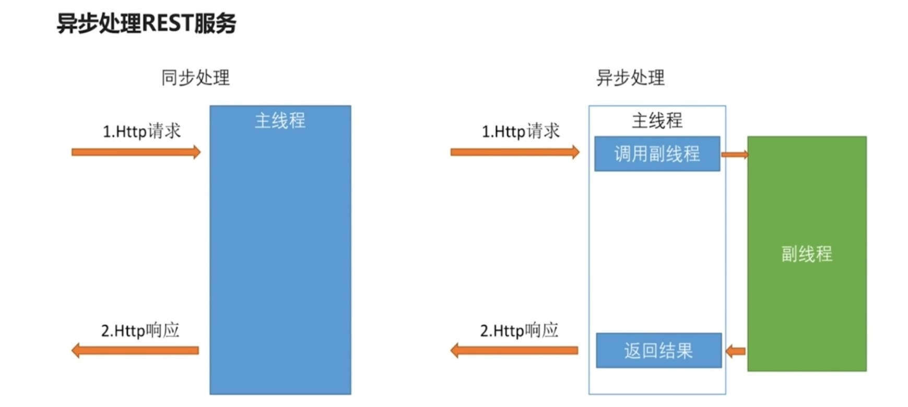
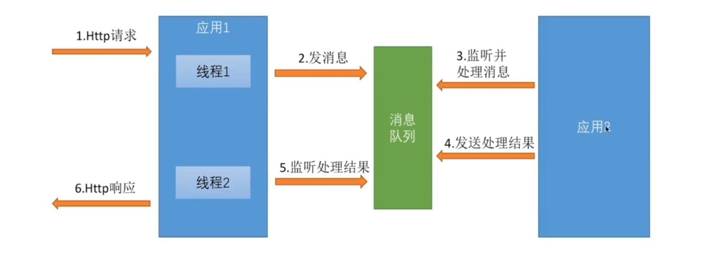
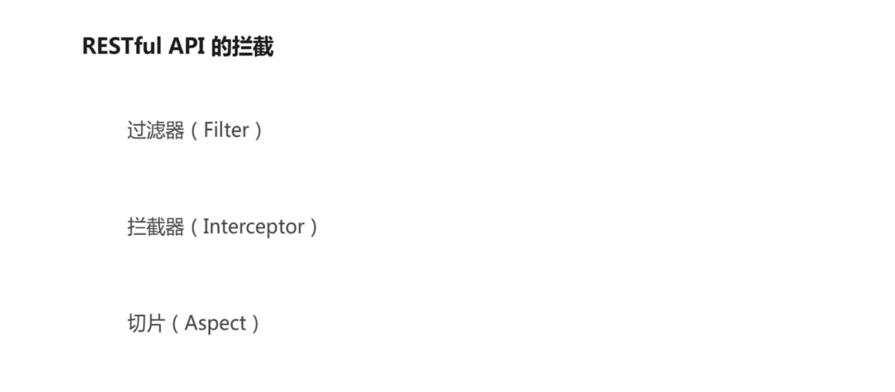
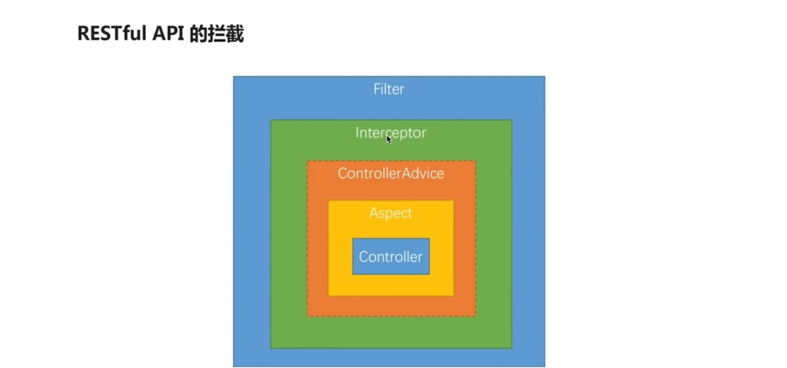
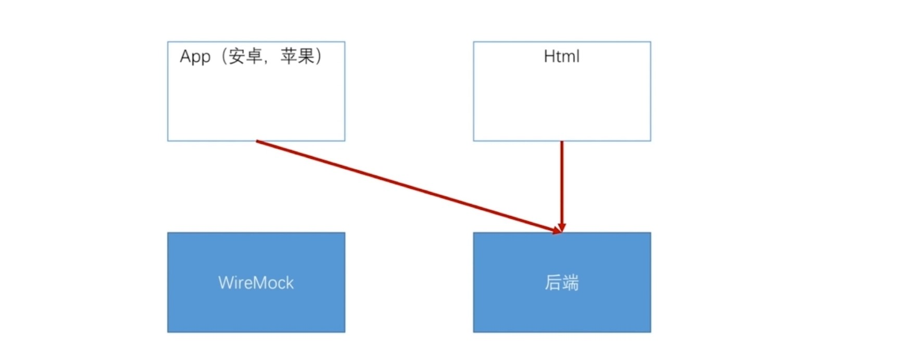

## 1.开发基本的增删改查接口

### 使用Spring MVC编写Restful API



### 编写针对RestfulAPI的测试用例
security-demo：
```java
@RunWith(SpringRunner.class)
@SpringBootTest
public class UserControllerTest {
	@Autowired
	private WebApplicationContext wac;
	private MockMvc mockMvc;

	@Before
	public void setup() {
		mockMvc = MockMvcBuilders.webAppContextSetup(wac).build();
	}

	@Test
	public void whenQuerySuccess() throws Exception {
		String result = mockMvc.perform(
				get("/user").param("username", "jojo").param("age", "18").param("ageTo", "60").param("xxx", "yyy")
						// .param("size", "15")
						// .param("page", "3")
						// .param("sort", "age,desc")
						.contentType(MediaType.APPLICATION_JSON_UTF8))
				.andExpect(status().isOk()).andExpect(jsonPath("$.length()").value(3))
				.andReturn().getResponse().getContentAsString();

		System.out.println(result);
	}

	@Test
	public void whenGetInfoSuccess() throws Exception {
		String result = mockMvc.perform(get("/user/1")
				.contentType(MediaType.APPLICATION_JSON_UTF8))
				.andExpect(status().isOk())
				.andExpect(jsonPath("$.username").value("tom"))
				.andReturn().getResponse().getContentAsString();

		System.out.println(result);
	}

	@Test
	public void whenGetInfoFail() throws Exception {
		mockMvc.perform(get("/user/a")
				.contentType(MediaType.APPLICATION_JSON_UTF8))
				.andExpect(status().is4xxClientError());
	}

	@Test
	public void whenCreateSuccess() throws Exception {

		Date date = new Date();
		System.out.println(date.getTime());
		String content = "{\"username\":\"tom\",\"password\":null,\"birthday\":"+date.getTime()+"}";
		String reuslt = mockMvc.perform(post("/user").contentType(MediaType.APPLICATION_JSON_UTF8)
				.content(content))
				.andExpect(status().isOk())
				.andExpect(jsonPath("$.id").value("1"))
				.andReturn().getResponse().getContentAsString();

		System.out.println(reuslt);
	}

	@Test
	public void whenCreateFail() throws Exception {

		Date date = new Date();
		System.out.println(date.getTime());
		String content = "{\"username\":\"tom\",\"password\":null,\"birthday\":"+date.getTime()+"}";
		String reuslt = mockMvc.perform(post("/user").contentType(MediaType.APPLICATION_JSON_UTF8)
				.content(content))
//				.andExpect(status().isOk())
//				.andExpect(jsonPath("$.id").value("1"))
				.andReturn().getResponse().getContentAsString();

		System.out.println(reuslt);
	}

	@Test
	public void whenUpdateSuccess() throws Exception {

		Date date = new Date(LocalDateTime.now().plusYears(1).atZone(ZoneId.systemDefault()).toInstant().toEpochMilli());
		System.out.println(date.getTime());
		String content = "{\"id\":\"1\", \"username\":\"tom\",\"password\":null,\"birthday\":"+date.getTime()+"}";
		String reuslt = mockMvc.perform(put("/user/1").contentType(MediaType.APPLICATION_JSON_UTF8)
				.content(content))
				.andExpect(status().isOk())
				.andExpect(jsonPath("$.id").value("1"))
				.andReturn().getResponse().getContentAsString();

		System.out.println(reuslt);
	}

	@Test
	public void whenDeleteSuccess() throws Exception {
		mockMvc.perform(delete("/user/1")
				.contentType(MediaType.APPLICATION_JSON_UTF8))
				.andExpect(status().isOk());
	}
}
```
```java
@Data
public class User {
	private String id;
	private String username;
	private String password;
}
```

### 在url声明中使用正则表达式 & @PageableDefault指定分页参数默认值
security-demo：
```java
@RestController
@RequestMapping("/user")
public class UserController {
	@GetMapping
	@JsonView(User.UserSimpleView.class)
	public List<User> query(
			@PageableDefault(page = 2, size = 17, sort = "username,asc") Pageable pageable) {
		List<User> users = new ArrayList<>();
		users.add(new User());
		users.add(new User());
		users.add(new User());
		return users;
	}

	@GetMapping("/{id:\\d+}")
	@JsonView(User.UserDetailView.class)
	public User getInfo(@PathVariable String id) {
		User user = new User();
		user.setUsername("tom");
		return user;
	}
}
```

### @JsonView控制json输出内容
1.使用接口来声明多个视图
2.在值对象的get方法上指定视图
3.在Controller方法上指定视图
```java
@Setter
public class User {
	public interface UserSimpleView {};
	public interface UserDetailView extends UserSimpleView {};

	private String id;
	private String username;
	private String password;

	@JsonView(UserSimpleView.class)
	public String getUsername() {
		return username;
	}

	@JsonView(UserDetailView.class)
	public String getPassword() {
		return password;
	}

	@JsonView(UserSimpleView.class)
	public String getId() {
		return id;
	}
}
```
```java
@GetMapping("/{id:\\d+}")
@JsonView(User.UserDetailView.class)
public User getInfo(@PathVariable String id) {
  User user = new User();
  user.setUsername("tom");
  return user;
}
```

### 文件上传下载
```java
@Test
public void whenUploadSuccess() throws Exception {
	String result = mockMvc.perform(fileUpload("/file")
			.file(new MockMultipartFile("file", "test.txt", "multipart/form-data", "hello upload".getBytes("UTF-8"))))
			.andExpect(status().isOk())
			.andReturn().getResponse().getContentAsString();
	System.out.println(result);
}
```
```java
@RestController
@RequestMapping("/file")
public class FileController {
	private String folder = "/Users/path";

	@PostMapping
	public FileInfo upload(MultipartFile file) throws Exception {

		System.out.println(file.getName());
		System.out.println(file.getOriginalFilename());
		System.out.println(file.getSize());

		File localFile = new File(folder, new Date().getTime() + ".txt");
		file.transferTo(localFile);

		return new FileInfo(localFile.getAbsolutePath());
	}

	@GetMapping("/{id}")
	public void download(@PathVariable String id, HttpServletRequest request, HttpServletResponse response) throws Exception {

		try (InputStream inputStream = new FileInputStream(new File(folder, id + ".txt"));
				OutputStream outputStream = response.getOutputStream();) {

			response.setContentType("application/x-download");
			response.addHeader("Content-Disposition", "attachment;filename=test.txt");

			IOUtils.copy(inputStream, outputStream);
			outputStream.flush();
		}
	}
}
```
```java
@Data
@AllArgsConstructor
public class FileInfo {
	private String path;
}
```

### 异步处理REST服务
使用Runnable异步处理：

```java
@RestController
public class AsyncController {
	@RequestMapping("/order")
	public void order() throws Exception {
		logger.info("主线程开始");

		Callable<String> result = new Callable<String>() {
			@Override
			public String call() throws Exception {
				logger.info("副线程开始");
				Thread.sleep(1000);
				logger.info("副线程返回");
				return "success";
			}
		};
	}
}
```
使用DeferredResult异步处理REST服务：

```java
@RestController
public class AsyncController {
	@Autowired
	private MockQueue mockQueue;

	@Autowired
	private DeferredResultHolder deferredResultHolder;

	private Logger logger = LoggerFactory.getLogger(getClass());

	@RequestMapping("/order")
	public DeferredResult<String> order() throws Exception {
		logger.info("主线程开始");

		String orderNumber = RandomStringUtils.randomNumeric(8);
		mockQueue.setPlaceOrder(orderNumber);

		DeferredResult<String> result = new DeferredResult<>();
		deferredResultHolder.getMap().put(orderNumber, result);

		return result;
	}
}
```
```java
@Component
public class DeferredResultHolder {
	private Map<String, DeferredResult<String>> map = new HashMap<String, DeferredResult<String>>();

	public Map<String, DeferredResult<String>> getMap() {
		return map;
	}

	public void setMap(Map<String, DeferredResult<String>> map) {
		this.map = map;
	}
}
```
```java
@Component
public class MockQueue {
	private String placeOrder;
	private String completeOrder;
	private Logger logger = LoggerFactory.getLogger(getClass());

	public String getPlaceOrder() {
		return placeOrder;
	}

	public void setPlaceOrder(String placeOrder) throws Exception {
		new Thread(() -> {
			logger.info("接到下单请求, " + placeOrder);
			try {
				Thread.sleep(1000);
			} catch (Exception e) {
				e.printStackTrace();
			}
			this.completeOrder = placeOrder;
			logger.info("下单请求处理完毕," + placeOrder);
		}).start();
	}

	public String getCompleteOrder() {
		return completeOrder;
	}

	public void setCompleteOrder(String completeOrder) {
		this.completeOrder = completeOrder;
	}
}
```

## 2.Spring MVC 高级特性




## 3.REST服务开发常用工具
### 使用swagger自动生成html文档
```xml
		<dependency>
			<groupId>io.springfox</groupId>
			<artifactId>springfox-swagger2</artifactId>
			<version>2.7.0</version>
		</dependency>
		<dependency>
			<groupId>io.springfox</groupId>
			<artifactId>springfox-swagger-ui</artifactId>
			<version>2.7.0</version>
		</dependency>
```
```
@EnableSwagger2
@ApiModelProperty
@ApiOperation
@ApiParam
```

### 使用WireMock快速伪造RESTful服务


```sh
java -jar wiremock-standalone-2.7.1.jar --port 8062
```
```xml
<dependency>
	<groupId>com.github.tomakehurst</groupId>
	<artifactId>wiremock</artifactId>
</dependency>
```
```java
public class MockServer {
	public static void main(String[] args) throws IOException {
		configureFor(8062);
		removeAllMappings();

		mock("/order/1", "01");
		mock("/order/2", "02");
	}

	private static void mock(String url, String file) throws IOException {
		ClassPathResource resource = new ClassPathResource("mock/response/" + file + ".txt");
		String content = StringUtils.join(FileUtils.readLines(resource.getFile(), "UTF-8").toArray(), "\n");
		stubFor(get(urlPathEqualTo(url)).willReturn(aResponse().withBody(content).withStatus(200)));
	}
}
```
